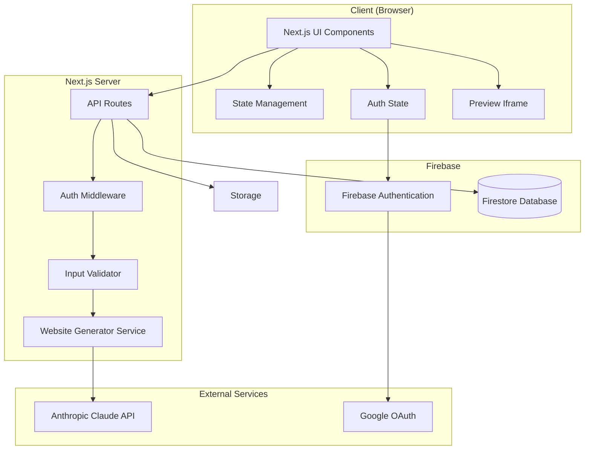
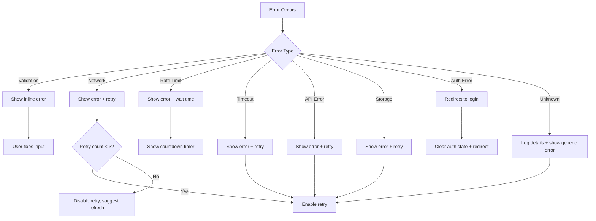

# Technical Design Document: AI Website Generator

## Overview

The AI Website Generator is a Next.js web application that enables users to create complete websites through two input methods: natural language text descriptions or screenshot uploads. The application leverages the Anthropic Claude API for AI-powered code generation, utilizing both text processing and vision capabilities. Users authenticate via Google Sign-In through Firebase Authentication, and their generated websites are stored securely in Firebase Firestore (including thumbnails as base64 data URLs).

### Key Features

- **Google Authentication**: Secure sign-in via Firebase Authentication with Google OAuth
- **Dual Input Modes**: Support for text-based descriptions and screenshot-based generation
- **Live Preview**: Real-time website preview with responsive viewport modes
- **Code Editor**: Built-in HTML/CSS editor with syntax highlighting
- **Cloud Persistence**: Firebase Firestore for storing generated websites with cross-device access
- **Download Options**: Export as single HTML file or ZIP archive with separate files

### Design Goals

1. **Security**: User authentication via Google Sign-In; data isolation per user
2. **Cross-Device Access**: Cloud storage enables access from any device
3. **Performance**: Fast generation with clear loading states and cancellation support
4. **Reliability**: Robust error handling with recovery options
5. **Security**: Sanitized preview rendering to prevent XSS attacks

## Architecture

### High-Level Architecture



### Component Architecture

The application follows a layered architecture:

1. **Presentation Layer**: React components for UI rendering
2. **Authentication Layer**: Firebase Auth with Google OAuth provider
3. **Application Layer**: Next.js API routes and client-side state management
4. **Service Layer**: Business logic for generation, validation, and persistence
5. **Data Layer**: Firebase Firestore for documents (including thumbnails as base64)

### Technology Stack

| Layer           | Technology                 | Purpose                                          |
| --------------- | -------------------------- | ------------------------------------------------ |
| Framework       | Next.js 16 (App Router)    | Full-stack React framework                       |
| UI              | React 19                   | Component-based UI                               |
| Styling         | Tailwind CSS               | Utility-first styling                            |
| State           | React Context + useReducer | Client-side state management                     |
| Authentication  | Firebase Authentication    | Google OAuth sign-in                             |
| Database        | Firebase Firestore         | Cloud document storage (incl. thumbnails)        |
| AI              | @anthropic-ai/sdk          | Official Anthropic TypeScript SDK for Claude API |
| Code Editor     | Monaco Editor              | Syntax highlighting and editing                  |
| File Generation | JSZip                      | ZIP archive creation                             |

## Components and Interfaces

### Frontend Components

#### Page Components

```typescript
// app/page.tsx - Login page (public)
interface LoginPageProps {}

// app/dashboard/page.tsx - Homepage/Dashboard (protected)
interface DashboardPageProps {}

// app/generate/page.tsx - Generation page (protected)
interface GeneratePageProps {}

// app/website/[id]/page.tsx - Website preview/editor page (protected)
interface WebsitePageProps {
  params: { id: string };
}

// app/view/[id]/page.tsx - Full website view (public, shareable)
// Renders the generated HTML/CSS as a standalone full-page website
interface ViewPageProps {
  params: { id: string };
}
```

#### Authentication Components

```typescript
// components/auth/GoogleSignInButton.tsx
interface GoogleSignInButtonProps {
  onSuccess?: () => void;
  onError?: (error: Error) => void;
}

// components/auth/AuthProvider.tsx
interface AuthProviderProps {
  children: React.ReactNode;
}

// components/auth/ProtectedRoute.tsx
interface ProtectedRouteProps {
  children: React.ReactNode;
  fallback?: React.ReactNode;
}

// components/auth/UserProfileMenu.tsx
interface UserProfileMenuProps {
  user: AuthenticatedUser;
  onSignOut: () => void;
}

// components/layout/AppHeader.tsx
interface AppHeaderProps {
  user: AuthenticatedUser | null;
}

// components/layout/ThemeToggle.tsx
interface ThemeToggleProps {
  theme: 'light' | 'dark' | 'system';
  onThemeChange: (theme: 'light' | 'dark' | 'system') => void;
}

// components/layout/ThemeProvider.tsx
interface ThemeProviderProps {
  children: React.ReactNode;
  defaultTheme?: 'light' | 'dark' | 'system';
  storageKey?: string;
}
```

#### UI Components

```typescript
// components/WebsiteCard.tsx
interface WebsiteCardProps {
  website: GeneratedWebsite;
  onDelete: (id: string) => void;
  onTitleEdit: (id: string, newTitle: string) => void;
}

// components/InputModeSelector.tsx
interface InputModeSelectorProps {
  activeMode: 'text' | 'screenshot';
  onModeChange: (mode: 'text' | 'screenshot') => void;
  hasContent: boolean;
}

// components/TextInput.tsx
interface TextInputProps {
  value: string;
  onChange: (value: string) => void;
  onSubmit: () => void;
  disabled: boolean;
  error?: string;
}

// components/ScreenshotUpload.tsx
interface ScreenshotUploadProps {
  file: File | null;
  onFileSelect: (file: File) => void;
  onSubmit: () => void;
  disabled: boolean;
  error?: string;
}

// components/PreviewRenderer.tsx
interface PreviewRendererProps {
  html: string;
  css: string;
  viewportMode: 'desktop' | 'tablet' | 'mobile';
  onViewportChange: (mode: 'desktop' | 'tablet' | 'mobile') => void;
}

// components/CodeEditor.tsx
interface CodeEditorProps {
  html: string;
  css: string;
  onHtmlChange: (html: string) => void;
  onCssChange: (css: string) => void;
  activeTab: 'html' | 'css';
  onTabChange: (tab: 'html' | 'css') => void;
}

// components/LoadingIndicator.tsx
interface LoadingIndicatorProps {
  stage: GenerationStage;
  onCancel: () => void;
  elapsedTime: number;
  /** Optional streaming content to display in collapsible preview panel */
  streamingContent?: string;
}

// components/DownloadDialog.tsx
interface DownloadDialogProps {
  isOpen: boolean;
  onClose: () => void;
  onDownload: (format: 'single' | 'zip') => void;
  websiteTitle: string;
}

// components/DeleteConfirmDialog.tsx
interface DeleteConfirmDialogProps {
  isOpen: boolean;
  websiteTitle: string;
  onConfirm: () => void;
  onCancel: () => void;
}

// components/ErrorMessage.tsx
interface ErrorMessageProps {
  message: string;
  onDismiss: () => void;
  onRetry?: () => void;
}

// components/Pagination.tsx
interface PaginationProps {
  currentPage: number;
  totalPages: number;
  onPageChange: (page: number) => void;
}
```

### Backend Services

#### API Route Handlers

```typescript
// app/api/generate/route.ts
interface GenerateTextRequest {
  type: 'text';
  description: string;
}

interface GenerateScreenshotRequest {
  type: 'screenshot';
  image: string; // Base64 encoded
  mimeType: 'image/png' | 'image/jpeg' | 'image/webp';
}

type GenerateRequest = GenerateTextRequest | GenerateScreenshotRequest;

interface GenerateResponse {
  success: true;
  data: {
    html: string;
    css: string;
    title: string;
  };
}

interface GenerateErrorResponse {
  success: false;
  error: {
    code: ErrorCode;
    message: string;
    retryAfter?: number; // For rate limiting
  };
}

// app/api/generate/stream/route.ts - Streaming endpoint for both text and screenshot
// Accepts: { type: 'text', description: string } or { type: 'screenshot', image: string, mimeType: string }
// Returns Server-Sent Events (SSE) stream
// Events:
//   - start: Generation has started
//   - text: New text chunk received { content: string }
//   - done: Generation complete { result: { html, css, title } }
//   - error: An error occurred { error: string }
interface StreamEventData {
  content?: string;
  result?: {
    html: string;
    css: string;
    title: string;
  };
  error?: string;
}
```

#### Service Interfaces

```typescript
// services/authService.ts
interface AuthService {
  signInWithGoogle(): Promise<AuthenticatedUser>;
  signOut(): Promise<void>;
  getCurrentUser(): AuthenticatedUser | null;
  onAuthStateChange(callback: (user: AuthenticatedUser | null) => void): () => void;
}

interface AuthenticatedUser {
  uid: string;
  email: string;
  displayName: string;
  photoURL: string | null;
}

// services/websiteGenerator.ts
interface WebsiteGeneratorService {
  generateFromText(description: string, signal?: AbortSignal): Promise<GenerationResult>;
  generateFromScreenshot(
    image: string,
    mimeType: string,
    signal?: AbortSignal
  ): Promise<GenerationResult>;
  /** Streaming generation for text input - yields real-time progress events */
  generateFromTextStream(
    description: string,
    signal?: AbortSignal
  ): AsyncGenerator<StreamEvent>;
  /** Streaming generation for screenshot input - yields real-time progress events */
  generateFromScreenshotStream(
    image: string,
    mimeType: string,
    signal?: AbortSignal
  ): AsyncGenerator<StreamEvent>;
}

interface StreamEvent {
  type: 'start' | 'text' | 'done' | 'error';
  content?: string;
  result?: GenerationResult;
  error?: string;
}

interface GenerationResult {
  html: string;
  css: string;
  title: string;
}

// services/inputValidator.ts
interface InputValidatorService {
  validateTextInput(text: string): ValidationResult;
  validateScreenshotInput(file: File): Promise<ValidationResult>;
}

interface ValidationResult {
  valid: boolean;
  error?: string;
}

// services/websiteRepository.ts
interface WebsiteRepositoryService {
  save(userId: string, website: Omit<GeneratedWebsite, 'id' | 'userId'>): Promise<string>;
  getById(userId: string, id: string): Promise<GeneratedWebsite | null>;
  getAllByUser(
    userId: string,
    page: number,
    pageSize: number
  ): Promise<PaginatedResult<GeneratedWebsite>>;
  update(userId: string, id: string, updates: Partial<GeneratedWebsite>): Promise<void>;
  delete(userId: string, id: string): Promise<void>;
  generateThumbnail(html: string, css: string): Promise<string>; // Returns base64 data URL
}

interface PaginatedResult<T> {
  items: T[];
  total: number;
  page: number;
  pageSize: number;
  totalPages: number;
}

// services/downloadService.ts
interface DownloadService {
  generateSingleFile(html: string, css: string, title: string): Promise<Blob>;
  generateZipArchive(html: string, css: string, title: string): Promise<Blob>;
}

// services/htmlSanitizer.ts
interface HtmlSanitizerService {
  sanitize(html: string): string;
}
```

### Claude API Integration

```typescript
// lib/claude.ts
import Anthropic from '@anthropic-ai/sdk';

const anthropic = new Anthropic({
  apiKey: process.env.ANTHROPIC_API_KEY,
});

// Using Claude Haiku 4.5 - fastest and most cost-effective model
const CLAUDE_MODEL = 'claude-haiku-4-5-20251001';

interface ClaudeClient {
  generateWebsite(prompt: string, signal?: AbortSignal): Promise<ClaudeResponse>;
  generateWebsiteFromImage(
    imageBase64: string,
    mimeType: string,
    signal?: AbortSignal
  ): Promise<ClaudeResponse>;
}

interface ClaudeResponse {
  content: string;
  usage: {
    inputTokens: number;
    outputTokens: number;
  };
}

// Text-based generation
export async function generateWebsiteFromText(
  description: string,
  signal?: AbortSignal
): Promise<ClaudeResponse> {
  const message = await anthropic.messages.create({
    model: CLAUDE_MODEL,
    max_tokens: 8192,
    messages: [
      {
        role: 'user',
        content: `${TEXT_GENERATION_PROMPT}\n\nDescription: ${description}`,
      },
    ],
  });

  return {
    content: message.content[0].type === 'text' ? message.content[0].text : '',
    usage: {
      inputTokens: message.usage.input_tokens,
      outputTokens: message.usage.output_tokens,
    },
  };
}

// Screenshot-based generation (using vision)
export async function generateWebsiteFromImage(
  imageBase64: string,
  mimeType: 'image/png' | 'image/jpeg' | 'image/webp',
  signal?: AbortSignal
): Promise<ClaudeResponse> {
  const message = await anthropic.messages.create({
    model: CLAUDE_MODEL,
    max_tokens: 8192,
    messages: [
      {
        role: 'user',
        content: [
          {
            type: 'image',
            source: {
              type: 'base64',
              media_type: mimeType,
              data: imageBase64,
            },
          },
          {
            type: 'text',
            text: SCREENSHOT_GENERATION_PROMPT,
          },
        ],
      },
    ],
  });

  return {
    content: message.content[0].type === 'text' ? message.content[0].text : '',
    usage: {
      inputTokens: message.usage.input_tokens,
      outputTokens: message.usage.output_tokens,
    },
  };
}

// System prompts
const TEXT_GENERATION_PROMPT = `You are a website generator. Given a description, generate complete HTML and CSS code for a website.

Requirements:
- Generate semantic HTML5 using proper elements (header, nav, main, section, article, aside, footer)
- Ensure accessibility: use ARIA labels where needed, proper heading hierarchy, alt text for images, sufficient color contrast
- Use CSS Grid and/or Flexbox for layouts
- Make the design fully responsive with mobile-first approach and media queries
- Follow BEM (Block Element Modifier) naming convention for CSS classes
- Include viewport meta tag and other necessary meta tags
- Do not include any JavaScript
- Include dark theme support using CSS custom properties and prefers-color-scheme media query

CSS Guidelines (BEM):
- Blocks: .card, .header, .navigation
- Elements: .card__title, .card__image, .navigation__item
- Modifiers: .card--featured, .button--primary, .navigation__item--active

Dark Theme Guidelines:
- Define CSS custom properties (--color-bg, --color-text, --color-primary, etc.)
- Use :root for light theme defaults
- Use @media (prefers-color-scheme: dark) for dark theme overrides
- Ensure WCAG AA contrast ratios in both themes

Output format:
\`\`\`html
[HTML code here]
\`\`\`

\`\`\`css
[CSS code here]
\`\`\`

Also generate a concise title (3-100 characters) that summarizes the website's purpose.
Title: [title here]`;

const SCREENSHOT_GENERATION_PROMPT = `You are a website generator. Analyze this screenshot and generate HTML and CSS code that replicates the design as closely as possible.

Requirements:
- Generate semantic HTML5 using proper elements (header, nav, main, section, article, aside, footer)
- Ensure accessibility: use ARIA labels where needed, proper heading hierarchy, alt text for images, sufficient color contrast
- Match the layout, colors, and typography from the screenshot
- Use CSS Grid and/or Flexbox for layouts
- Make the design fully responsive with mobile-first approach and media queries
- Follow BEM (Block Element Modifier) naming convention for CSS classes
- Include viewport meta tag and other necessary meta tags
- Do not include any JavaScript
- Include dark theme support using CSS custom properties and prefers-color-scheme media query

CSS Guidelines (BEM):
- Blocks: .card, .header, .navigation
- Elements: .card__title, .card__image, .navigation__item
- Modifiers: .card--featured, .button--primary, .navigation__item--active

Dark Theme Guidelines:
- Define CSS custom properties (--color-bg, --color-text, --color-primary, etc.)
- Use :root for light theme defaults (matching the screenshot colors)
- Use @media (prefers-color-scheme: dark) for dark theme variant
- Ensure WCAG AA contrast ratios in both themes

Output format:
\`\`\`html
[HTML code here]
\`\`\`

\`\`\`css
[CSS code here]
\`\`\`

Also generate a concise title (3-100 characters) based on the website's apparent purpose.
Title: [title here]`;
```

## Data Models

### Core Entities

```typescript
// types/auth.ts
interface AuthenticatedUser {
  uid: string; // Firebase Auth UID
  email: string; // User's email address
  displayName: string; // User's display name from Google
  photoURL: string | null; // User's profile photo URL from Google
}

interface AuthState {
  user: AuthenticatedUser | null;
  loading: boolean;
  error: string | null;
}

// types/website.ts
interface GeneratedWebsite {
  id: string; // Firestore document ID
  userId: string; // Firebase Auth UID (owner)
  title: string; // 1-100 characters
  html: string; // Generated HTML code
  css: string; // Generated CSS code
  thumbnailUrl: string; // Base64 data URL or placeholder
  inputType: 'text' | 'screenshot';
  createdAt: string; // ISO 8601 timestamp
  updatedAt: string; // ISO 8601 timestamp
}

// types/generation.ts
type GenerationStage = 'processing_input' | 'generating_html' | 'generating_css' | 'finalizing';

interface GenerationState {
  isGenerating: boolean;
  stage: GenerationStage | null;
  progress: number; // 0-100
  elapsedTime: number; // milliseconds
  error: string | null;
}

// types/input.ts
interface TextInputState {
  mode: 'text';
  value: string;
  error: string | null;
}

interface ScreenshotInputState {
  mode: 'screenshot';
  file: File | null;
  preview: string | null; // Data URL for preview
  error: string | null;
}

type InputState = TextInputState | ScreenshotInputState;

// types/error.ts
type ErrorCode =
  | 'VALIDATION_ERROR'
  | 'NETWORK_ERROR'
  | 'API_ERROR'
  | 'RATE_LIMIT_ERROR'
  | 'TIMEOUT_ERROR'
  | 'GENERATION_ERROR'
  | 'STORAGE_ERROR'
  | 'AUTH_ERROR'
  | 'UNKNOWN_ERROR';

interface AppError {
  code: ErrorCode;
  message: string;
  details?: string;
  retryAfter?: number;
}
```

### Firebase Configuration

#### Client-Side Configuration (lib/firebase.ts)

```typescript
// lib/firebase.ts
import { initializeApp } from 'firebase/app';
import { getAuth, GoogleAuthProvider } from 'firebase/auth';
import { getFirestore } from 'firebase/firestore';
import { getStorage } from 'firebase/storage';

const firebaseConfig = {
  apiKey: process.env.NEXT_PUBLIC_FIREBASE_API_KEY,
  authDomain: process.env.NEXT_PUBLIC_FIREBASE_AUTH_DOMAIN,
  projectId: process.env.NEXT_PUBLIC_FIREBASE_PROJECT_ID,
  storageBucket: process.env.NEXT_PUBLIC_FIREBASE_STORAGE_BUCKET,
  messagingSenderId: process.env.NEXT_PUBLIC_FIREBASE_MESSAGING_SENDER_ID,
  appId: process.env.NEXT_PUBLIC_FIREBASE_APP_ID,
};

const app = initializeApp(firebaseConfig);
export const auth = getAuth(app);
export const googleProvider = new GoogleAuthProvider();
export const db = getFirestore(app);
export const storage = getStorage(app);
```

#### Server-Side Configuration (lib/firebaseAdmin.ts)

The Firebase Admin SDK is used for server-side token verification in API routes. It requires a service account credential.

**Configuration Options:**

**Option 1: Full Service Account JSON (Recommended for Vercel)**
- `FIREBASE_SERVICE_ACCOUNT` - The entire service account JSON file content

**Option 2: Individual Environment Variables (Legacy)**
- `FIREBASE_ADMIN_PROJECT_ID` - Firebase project ID
- `FIREBASE_ADMIN_CLIENT_EMAIL` - Service account email (e.g., `firebase-adminsdk-xxxxx@project-id.iam.gserviceaccount.com`)
- `FIREBASE_ADMIN_PRIVATE_KEY` - Service account private key (with `\n` for newlines)

**How to obtain:**
1. Go to Firebase Console → Project Settings → Service accounts
2. Click "Generate new private key"
3. For Option 1: Copy the entire JSON content and set as `FIREBASE_SERVICE_ACCOUNT`
4. For Option 2: Extract the individual values from the downloaded JSON file

```typescript
// lib/firebaseAdmin.ts
import { initializeApp, getApps, cert, App, ServiceAccount } from 'firebase-admin/app';
import { getAuth, Auth } from 'firebase-admin/auth';

function getServiceAccount(): ServiceAccount {
  // Option 1: Full service account JSON (recommended)
  const serviceAccountJson = process.env.FIREBASE_SERVICE_ACCOUNT;
  if (serviceAccountJson) {
    return JSON.parse(serviceAccountJson) as ServiceAccount;
  }

  // Option 2: Individual env vars (legacy)
  return {
    projectId: process.env.FIREBASE_ADMIN_PROJECT_ID,
    clientEmail: process.env.FIREBASE_ADMIN_CLIENT_EMAIL,
    privateKey: process.env.FIREBASE_ADMIN_PRIVATE_KEY?.replace(/\\n/g, '\n'),
  } as ServiceAccount;
}

function getFirebaseAdminApp(): App {
  if (getApps().length > 0) {
    return getApps()[0];
  }
  return initializeApp({
    credential: cert(getServiceAccount()),
  });
}

export function getAdminAuth(): Auth {
  return getAuth(getFirebaseAdminApp());
}

export async function verifyIdToken(idToken: string) {
  return getAdminAuth().verifyIdToken(idToken);
}
```

### Firestore Schema

```typescript
// Collection: websites
// Document ID: auto-generated
interface WebsiteDocument {
  userId: string;                // Firebase Auth UID (indexed)
  title: string;
  html: string;
  css: string;
  thumbnailUrl: string;
  inputType: 'text' | 'screenshot';
  createdAt: Timestamp;          // Firestore Timestamp (indexed)
  updatedAt: Timestamp;
}

// Firestore indexes (firestore.indexes.json)
{
  "indexes": [
    {
      "collectionGroup": "websites",
      "queryScope": "COLLECTION",
      "fields": [
        { "fieldPath": "userId", "order": "ASCENDING" },
        { "fieldPath": "createdAt", "order": "DESCENDING" }
      ]
    }
  ]
}
```

### Firestore Security Rules

```javascript
// firestore.rules
rules_version = '2';
service cloud.firestore {
  match /databases/{database}/documents {
    // Websites collection
    match /websites/{websiteId} {
      // Allow read only if user owns the document
      allow read: if request.auth != null && request.auth.uid == resource.data.userId;

      // Allow create only if authenticated and userId matches auth uid
      allow create: if request.auth != null && request.auth.uid == request.resource.data.userId;

      // Allow update/delete only if user owns the document
      allow update, delete: if request.auth != null && request.auth.uid == resource.data.userId;
    }
  }
}
```

### Firebase Storage Rules

```javascript
// storage.rules
rules_version = '2';
service firebase.storage {
  match /b/{bucket}/o {
    // Thumbnails path: thumbnails/{userId}/{websiteId}.png
    match /thumbnails/{userId}/{fileName} {
      // Allow read only to the owner
      allow read: if request.auth != null && request.auth.uid == userId;

      // Allow write only to the owner with size and type restrictions
      allow write: if request.auth != null
        && request.auth.uid == userId
        && request.resource.size < 1 * 1024 * 1024  // 1MB max
        && request.resource.contentType.matches('image/.*');
    }
  }
}
```

### Validation Constants

```typescript
// lib/constants.ts
const VALIDATION = {
  TEXT_INPUT: {
    MIN_LENGTH: 10,
    MAX_LENGTH: 10_000,
  },
  SCREENSHOT_INPUT: {
    MAX_SIZE_BYTES: 10 * 1024 * 1024, // 10MB
    MIN_WIDTH: 200,
    MIN_HEIGHT: 200,
    ALLOWED_TYPES: ['image/png', 'image/jpeg', 'image/webp'],
  },
  TITLE: {
    MIN_LENGTH: 1,
    MAX_LENGTH: 100,
  },
};

const TIMEOUTS = {
  GENERATION: 60_000, // 60 seconds
  DOWNLOAD: 5_000, // 5 seconds
  CANCEL: 5_000, // 5 seconds
  PREVIEW_UPDATE: 1_000, // 1 second debounce
};

const PAGINATION = {
  PAGE_SIZE: 12,
};

const VIEWPORT_DIMENSIONS = {
  desktop: { width: 1280, height: 800 },
  tablet: { width: 768, height: 1024 },
  mobile: { width: 375, height: 667 },
};

const THUMBNAIL_DIMENSIONS = {
  width: 320,
  height: 240,
};
```

## Correctness Properties

_A property is a characteristic or behavior that should hold true across all valid executions of a system—essentially, a formal statement about what the system should do. Properties serve as the bridge between human-readable specifications and machine-verifiable correctness guarantees._

### Property 1: Text Input Validation Boundaries

_For any_ string input, the text input validator SHALL accept the input if and only if the string length is between 10 and 10,000 characters inclusive (non-empty with at least 10 characters AND not exceeding 10,000 characters).

**Validates: Requirements 1.1, 1.6**

### Property 2: Screenshot Input Validation

_For any_ file upload, the screenshot input validator SHALL accept the file if and only if:

- The MIME type is one of: image/png, image/jpeg, or image/webp
- The file size does not exceed 10MB (10,485,760 bytes)
- The image dimensions are at least 200x200 pixels

**Validates: Requirements 2.1, 2.2, 2.3, 2.6, 2.7, 2.8**

### Property 3: Code Extraction Round-Trip

_For any_ valid HTML code block and CSS code block, when formatted as a Claude API response with markdown code blocks (`html and `css markers), the code extractor SHALL extract the original HTML and CSS content exactly.

**Validates: Requirements 1.3, 1.7, 2.5**

### Property 3a: Truncated Response Code Extraction

_For any_ truncated Claude API response containing an HTML code block without closing backticks (e.g., streaming cut off mid-generation), the code extractor SHALL:
- Extract the HTML content from the opening ` ```html ` marker to the end of available content or next code block marker
- Extract CSS from a separate CSS block if present, or from inline `<style>` tags within the HTML
- Return a result with `truncated: true` flag indicating partial extraction

**Validates: Requirements 20.8, 20.9**

### Property 4: Generated Website Object Completeness

_For any_ successful website generation with valid HTML, CSS, and title, the returned Generated_Website object SHALL contain all required fields: id (non-empty string), html (non-empty string), css (string), title (1-100 characters), inputType ('text' or 'screenshot'), createdAt (valid ISO 8601 timestamp), and updatedAt (valid ISO 8601 timestamp).

**Validates: Requirements 1.4**

### Property 5: HTML Sanitization Security

_For any_ HTML string containing potentially malicious elements (script tags, onclick/onerror/onload event handlers, javascript: URLs), the sanitizer SHALL remove all such elements while preserving valid structural HTML elements and styling attributes.

**Validates: Requirements 3.6**

### Property 6: Single File Download Generation

_For any_ HTML and CSS code pair, when generating a single HTML file download, the output file SHALL contain the original HTML with the CSS embedded within a `<style>` element in the document head.

**Validates: Requirements 4.2**

### Property 7: ZIP Archive Download Generation

_For any_ HTML and CSS code pair, when generating a ZIP archive download, the archive SHALL contain exactly two files: `index.html` with the HTML content (including a link to styles.css) and `styles.css` with the CSS content.

**Validates: Requirements 4.3**

### Property 8: Website Persistence Round-Trip

_For any_ Generated_Website object, when saved to the Website_Repository and subsequently retrieved by its ID, all fields (html, css, title, inputType, createdAt, thumbnail) SHALL match the original values exactly.

**Validates: Requirements 5.1, 10.6**

### Property 9: Unique Identifier Generation

_For any_ collection of N websites saved to the Website_Repository, all N generated IDs SHALL be unique (no duplicates).

**Validates: Requirements 5.3**

### Property 10: Website List Sorting

_For any_ collection of Generated_Websites retrieved from the Website_Repository, the returned list SHALL be sorted by createdAt in descending order (newest first), such that for any two consecutive items, the first item's createdAt is greater than or equal to the second item's createdAt.

**Validates: Requirements 6.3**

### Property 11: Pagination Correctness

_For any_ total count N of websites in the repository and page size of 12:

- The total number of pages SHALL equal ceil(N / 12)
- Each page (except possibly the last) SHALL contain exactly 12 items
- The last page SHALL contain between 1 and 12 items (or 0 if N is 0)
- The union of all pages SHALL contain all N websites exactly once

**Validates: Requirements 6.5**

### Property 12: Deletion Removes Website

_For any_ Generated_Website that has been saved to the Website_Repository, after successful deletion, attempting to retrieve that website by its ID SHALL return null/not found.

**Validates: Requirements 7.2**

### Property 13: Input Preservation on Cancel or Error

_For any_ user input (text description or screenshot file), if generation is cancelled or fails with an error, the original input SHALL remain unchanged in the input form, allowing immediate retry without re-entering data.

**Validates: Requirements 8.5, 12.4**

### Property 14: Input Mode Exclusivity

_For any_ sequence of input mode selections, at most one input mode (text or screenshot) SHALL be active at any given time.

**Validates: Requirements 9.6**

### Property 15: Mode Switch Confirmation Trigger

_For any_ input mode switch request, a confirmation dialog SHALL be displayed if and only if the current input contains at least one non-whitespace character.

**Validates: Requirements 9.7**

### Property 16: Title Length Validation

_For any_ title string, the title validator SHALL accept the title if and only if the string length is between 1 and 100 characters inclusive.

**Validates: Requirements 11.5**

### Property 17: Generated Title Constraints

_For any_ successfully generated website, the title field SHALL either:

- Contain between 3 and 100 characters (if extracted/generated from input), OR
- Match the pattern "Untitled Website [timestamp]" where timestamp is a valid creation timestamp

**Validates: Requirements 11.1, 11.2, 11.3**

### Property 18: Code Editor Modifications Preserved in Download

_For any_ modifications made to HTML or CSS in the code editor, when the user downloads the website, the downloaded content SHALL contain the modified code, not the original generated code.

**Validates: Requirements 10.5**

### Property 19: User Data Isolation

_For any_ authenticated user A and user B where A ≠ B, user A SHALL NOT be able to read, update, or delete any Generated_Website owned by user B.

**Validates: Requirements 5.4, 6.1**

### Property 20: Authentication State Persistence

_For any_ user who successfully signs in with Google, the authentication session SHALL persist across browser sessions until the user explicitly signs out or the session expires.

**Validates: Requirements 13.5**

### Property 21: Protected Route Access Control

_For any_ unauthenticated user attempting to access a protected route (dashboard, generate, website preview), the application SHALL redirect the user to the login page.

**Validates: Requirements 14.1, 14.2**

### Property 22: Post-Authentication Redirect

_For any_ user who is redirected to the login page from a protected route, after successful authentication, the application SHALL redirect the user to the originally requested protected route.

**Validates: Requirements 14.3**

## Error Handling

### Error Categories and Recovery Strategies

| Error Type       | Code             | User Message                                                | Recovery Action                 |
| ---------------- | ---------------- | ----------------------------------------------------------- | ------------------------------- |
| Validation Error | VALIDATION_ERROR | Specific message about what failed validation               | Fix input and resubmit          |
| Network Error    | NETWORK_ERROR    | "Unable to connect. Please check your internet connection." | Retry button (up to 3 attempts) |
| API Error        | API_ERROR        | "Generation failed. Please try again."                      | Retry button                    |
| Rate Limit       | RATE_LIMIT_ERROR | "Rate limit reached. Please wait {minutes} minutes."        | Auto-retry after wait time      |
| Timeout          | TIMEOUT_ERROR    | "Request timed out. Please try again."                      | Retry button                    |
| Generation Error | GENERATION_ERROR | "Failed to generate valid website code."                    | Retry button                    |
| Storage Error    | STORAGE_ERROR    | "Failed to save. Please try again."                         | Retry button                    |
| Auth Error       | AUTH_ERROR       | "Authentication failed. Please sign in again."              | Redirect to login               |
| Unknown Error    | UNKNOWN_ERROR    | "An unexpected error occurred."                             | Retry button                    |

### Error Handling Flow



### Error Message Component Behavior

1. **Display**: Error messages appear as dismissible banners or toast notifications
2. **Persistence**: Errors remain visible until dismissed or resolved
3. **Retry Button**: Included when applicable, triggers the failed operation
4. **Dismiss Button**: Always present, removes the error message from view
5. **Input Preservation**: User input is never cleared on error

### Logging Strategy

- **Client-side**: Errors logged to console in development, silent in production
- **Server-side**: All API errors logged with timestamp, error code, and sanitized context
- **Sensitive Data**: Never log user input content, only metadata (length, type)

## Testing Strategy

### Overview

The testing strategy employs a dual approach:

- **Property-based tests**: Verify universal properties across all valid inputs using the fast-check library
- **Unit tests**: Cover specific examples, edge cases, and error conditions
- **Integration tests**: Verify component interactions and UI behavior

### Property-Based Testing Configuration

**Library**: fast-check (JavaScript/TypeScript property-based testing library)

**Configuration**:

- Minimum 100 iterations per property test
- Seed logging for reproducibility
- Shrinking enabled for minimal counterexamples

**Tagging Convention**: Each property test includes a comment referencing the design property:

```typescript
// Feature: ai-website-generator, Property 1: Text Input Validation Boundaries
```

### Test Categories

#### 1. Input Validation Tests (Property-Based)

| Test                       | Property    | Generator                                              |
| -------------------------- | ----------- | ------------------------------------------------------ |
| Text length validation     | Property 1  | Arbitrary strings of length 0-15000                    |
| Screenshot file validation | Property 2  | File objects with random MIME types, sizes, dimensions |
| Title length validation    | Property 16 | Arbitrary strings of length 0-150                      |

#### 2. Code Processing Tests (Property-Based)

| Test                          | Property   | Generator                                                                           |
| ----------------------------- | ---------- | ----------------------------------------------------------------------------------- |
| Code extraction round-trip    | Property 3 | Random HTML/CSS code blocks formatted as API response                               |
| HTML sanitization             | Property 5 | HTML strings with random injection of script tags, event handlers, javascript: URLs |
| Generated object completeness | Property 4 | Random valid HTML, CSS, title combinations                                          |

#### 3. Download Generation Tests (Property-Based)

| Test                           | Property    | Generator                            |
| ------------------------------ | ----------- | ------------------------------------ |
| Single file generation         | Property 6  | Random HTML/CSS pairs                |
| ZIP archive generation         | Property 7  | Random HTML/CSS pairs                |
| Editor modifications preserved | Property 18 | Original and modified HTML/CSS pairs |

#### 4. Persistence Tests (Property-Based)

| Test                     | Property    | Generator                                |
| ------------------------ | ----------- | ---------------------------------------- |
| Save/retrieve round-trip | Property 8  | Random GeneratedWebsite objects          |
| Unique ID generation     | Property 9  | Lists of 1-100 website objects           |
| Sorting order            | Property 10 | Lists of websites with random timestamps |
| Pagination               | Property 11 | Collections of 0-50 websites             |
| Deletion                 | Property 12 | Random website, save, delete             |

#### 5. UI State Tests (Property-Based)

| Test                     | Property    | Generator                                               |
| ------------------------ | ----------- | ------------------------------------------------------- |
| Input preservation       | Property 13 | Random input with cancel/error trigger                  |
| Mode exclusivity         | Property 14 | Random sequences of mode selections                     |
| Mode switch confirmation | Property 15 | Random input strings (empty/non-empty) with mode switch |
| Title constraints        | Property 17 | Various API responses with/without extractable titles   |

#### 6. Unit Tests (Example-Based)

**Input Validation**:

- Empty string rejection
- Exactly 10 character acceptance
- Exactly 10,000 character acceptance
- 10,001 character rejection
- Supported image formats (PNG, JPG, JPEG, WebP)
- Unsupported format rejection (GIF, BMP, PDF)
- Exactly 10MB file acceptance
- 10MB + 1 byte rejection
- 200x200 pixel acceptance
- 199x200 and 200x199 rejection

**Error Handling**:

- Network error message and retry
- Rate limit error with wait time display
- Timeout error after 60 seconds
- API error message
- Storage error with retry

**UI Behavior**:

- Default text mode on load
- Viewport defaults to desktop
- Loading indicator visibility
- Cancel button visibility during generation
- Confirmation dialog on mode switch with content

#### 7. Integration Tests

**API Integration** (mocked Claude API):

- Text generation request flow
- Screenshot generation request flow
- Error response handling
- Timeout handling

**Storage Integration**:

- IndexedDB initialization
- CRUD operations
- Data persistence across page reloads

**UI Integration**:

- Preview rendering in iframe
- Code editor updates preview
- Download file generation and trigger
- Homepage list loading and pagination
- Delete confirmation and list update

### Test File Structure

```
tests/
├── unit/
│   ├── validators/
│   │   ├── textInputValidator.test.ts
│   │   ├── screenshotValidator.test.ts
│   │   └── titleValidator.test.ts
│   ├── services/
│   │   ├── authService.test.ts
│   │   ├── codeExtractor.test.ts
│   │   ├── htmlSanitizer.test.ts
│   │   ├── downloadService.test.ts
│   │   └── websiteRepository.test.ts
│   └── utils/
│       └── titleGenerator.test.ts
├── property/
│   ├── inputValidation.property.test.ts
│   ├── codeProcessing.property.test.ts
│   ├── downloadGeneration.property.test.ts
│   ├── persistence.property.test.ts
│   ├── authentication.property.test.ts
│   └── uiState.property.test.ts
├── integration/
│   ├── api/
│   │   └── generate.test.ts
│   ├── auth/
│   │   ├── googleSignIn.test.ts
│   │   ├── protectedRoutes.test.ts
│   │   └── sessionPersistence.test.ts
│   ├── storage/
│   │   └── firestore.test.ts
│   └── ui/
│       ├── loginPage.test.ts
│       ├── dashboard.test.ts
│       ├── generatePage.test.ts
│       └── previewPage.test.ts
└── e2e/
    ├── authentication.e2e.test.ts
    ├── textGeneration.e2e.test.ts
    ├── screenshotGeneration.e2e.test.ts
    └── websiteManagement.e2e.test.ts
```

### Test Commands

```bash
# Run all tests
npm test

# Run property tests only
npm run test:property

# Run unit tests only
npm run test:unit

# Run integration tests only
npm run test:integration

# Run e2e tests
npm run test:e2e

# Run tests with coverage
npm run test:coverage
```
