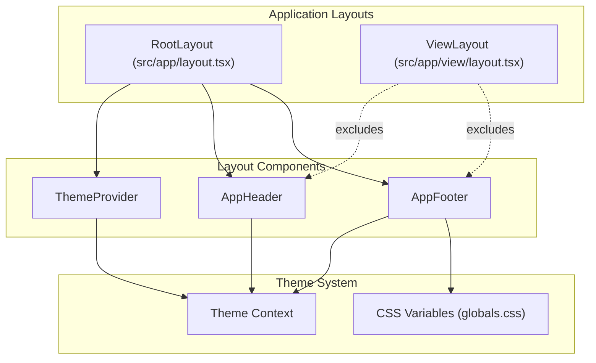

# Design Document: App Footer Copyright

## Overview

The App Footer Copyright feature adds a reusable footer component to the AI Website Generator application. The footer displays copyright information, social links to the developer's GitHub repository and LinkedIn profile, and call-to-action text encouraging user engagement.

The footer integrates seamlessly with the existing layout system:
- **Visible** on all pages using the Main App Layout (dashboard, protected routes)
- **Hidden** in Full Preview Mode (/view/[id] routes) to maintain clean, standalone website presentations

The component follows established patterns from `AppHeader.tsx`, using JSDoc documentation, exported TypeScript interfaces, Tailwind CSS with theme-aware CSS variables, and proper accessibility attributes.

## Architecture



### Layout Integration Strategy

The footer will be added to a new layout wrapper component or directly in page layouts that need it, rather than modifying the root layout. This approach:

1. **Respects existing architecture**: The root layout only contains providers; page-specific layouts handle UI structure
2. **Maintains View layout isolation**: The /view route's layout intentionally strips all app UI
3. **Follows composition patterns**: Similar to how AppHeader is used in specific page layouts

The recommended integration point is creating an `AppLayout` component that wraps pages needing the full app chrome (header + footer), or adding the footer to specific page layouts like the dashboard.

## Components and Interfaces

### AppFooter Component

**Location**: `src/components/layout/AppFooter.tsx`

```typescript
/**
 * AppFooter Component
 * Application footer with copyright notice, social links, and call-to-action text
 *
 * Requirements:
 * - 1.1: Display copyright notice with current year and developer name
 * - 1.2-1.3: Display GitHub and LinkedIn links opening in new tabs
 * - 1.4-1.5: Display call-to-action text for engagement
 * - 3.1-3.3: Adapt styling based on current theme using CSS variables
 * - 4.1-4.5: Include proper security and accessibility attributes
 * - 5.1-5.3: Responsive design with touch-friendly targets
 *
 * This component:
 * 1. Displays copyright with dynamic current year
 * 2. Shows GitHub link with star call-to-action
 * 3. Shows LinkedIn link with connect call-to-action
 * 4. Uses semantic HTML and ARIA attributes for accessibility
 * 5. Responds to theme changes via CSS variables
 */
```

### Props Interface

```typescript
/**
 * AppFooter props
 */
export interface AppFooterProps {
  /** Optional additional CSS classes */
  className?: string;
}
```

### Social Link Configuration

```typescript
/**
 * Social link configuration
 */
interface SocialLink {
  /** Display name for the platform */
  name: string;
  /** URL to the profile/repository */
  href: string;
  /** Accessible label describing the link */
  ariaLabel: string;
  /** Call-to-action text */
  ctaText: string;
  /** Icon component */
  icon: React.ComponentType<{ className?: string }>;
}

const socialLinks: SocialLink[] = [
  {
    name: 'GitHub',
    href: 'https://github.com/TarasMoskovych/ai-webstite-generator',
    ariaLabel: 'Visit the AI Website Generator GitHub repository (opens in new tab)',
    ctaText: 'Star on GitHub',
    icon: GitHubIcon,
  },
  {
    name: 'LinkedIn',
    href: 'https://www.linkedin.com/in/taras-moskovych/',
    ariaLabel: "Visit Taras Moskovych's LinkedIn profile (opens in new tab)",
    ctaText: 'Connect on LinkedIn',
    icon: LinkedInIcon,
  },
];
```

### Icon Components

The component will include inline SVG icon components following the pattern established in `AppHeader.tsx` and `ThemeToggle.tsx`:

```typescript
/**
 * GitHub icon
 */
function GitHubIcon({ className }: { className?: string }) {
  return (
    <svg
      xmlns="http://www.w3.org/2000/svg"
      viewBox="0 0 24 24"
      fill="currentColor"
      className={className}
      aria-hidden="true"
    >
      {/* GitHub logo path */}
    </svg>
  );
}

/**
 * LinkedIn icon
 */
function LinkedInIcon({ className }: { className?: string }) {
  return (
    <svg
      xmlns="http://www.w3.org/2000/svg"
      viewBox="0 0 24 24"
      fill="currentColor"
      className={className}
      aria-hidden="true"
    >
      {/* LinkedIn logo path */}
    </svg>
  );
}
```

### Component Structure

```tsx
export function AppFooter({ className }: AppFooterProps) {
  const currentYear = new Date().getFullYear();

  return (
    <footer
      className={`
        border-t border-border
        bg-background
        ${className ?? ''}
      `}
      role="contentinfo"
    >
      <div className="container mx-auto px-4 py-6">
        {/* Content sections */}
      </div>
    </footer>
  );
}
```

## Data Models

This feature does not introduce new data models or persistent state. All content is static or derived from the current date.

### Configuration Data

| Data | Type | Source | Description |
|------|------|--------|-------------|
| Current Year | `number` | `new Date().getFullYear()` | Dynamically computed for copyright |
| Developer Name | `string` | Static constant | "Taras Moskovych" |
| GitHub URL | `string` | Static constant | Repository URL |
| LinkedIn URL | `string` | Static constant | Profile URL |

## Error Handling

The AppFooter component is a presentational component with no external data dependencies, API calls, or user interactions that could produce errors. Error handling considerations:

1. **Year Computation**: `new Date().getFullYear()` is a synchronous operation that cannot fail in JavaScript runtimes
2. **External Links**: Links open in new tabs; any navigation errors are handled by the browser
3. **Theme Context**: The component uses CSS variables directly without requiring ThemeContext access, ensuring it renders correctly even if the theme system has issues
4. **Missing CSS Variables**: Tailwind utilities fall back gracefully if CSS variables are undefined (browser defaults apply)

No try-catch blocks or error boundaries are required for this component.

## Testing Strategy

### Why Property-Based Testing Does Not Apply

The App Footer is a presentational component with:
- **Static content**: Copyright text, link URLs, call-to-action text
- **Static configuration**: Security attributes, accessibility attributes
- **Deterministic behavior**: Year is computed once on render

Property-based testing is designed for functions with variable inputs where universal properties should hold across all valid inputs. The footer has no such variable input space—all outputs are predetermined by static configuration.

### Unit Tests

Unit tests will verify the component renders correctly and includes all required elements and attributes.

**Test File**: `src/components/layout/__tests__/AppFooter.test.tsx`

| Test Case | Validates Requirement |
|-----------|----------------------|
| Renders copyright notice with current year | 1.1 |
| Renders developer name in copyright | 1.1 |
| Renders GitHub link with correct href | 1.2 |
| GitHub link opens in new tab (target="_blank") | 1.2 |
| GitHub link has rel="noopener noreferrer" | 4.1 |
| GitHub link has descriptive aria-label | 4.3 |
| Renders GitHub star call-to-action text | 1.4 |
| Renders LinkedIn link with correct href | 1.3 |
| LinkedIn link opens in new tab (target="_blank") | 1.3 |
| LinkedIn link has rel="noopener noreferrer" | 4.2 |
| LinkedIn link has descriptive aria-label | 4.4 |
| Renders LinkedIn connect call-to-action text | 1.5 |
| Uses semantic footer element | 4.5 |
| Has role="contentinfo" for accessibility | 4.5 |
| Uses theme-aware CSS classes | 3.1, 3.3 |
| Applies responsive classes for mobile | 5.1, 5.2 |
| Links have touch-friendly sizing | 5.3 |
| Accepts and applies className prop | Component API |
| Does not use fixed/sticky positioning | 6.4 |

### Integration Tests

Integration tests will verify the footer's behavior within the application layout system.

| Test Case | Validates Requirement |
|-----------|----------------------|
| Footer renders on dashboard page | 2.1 |
| Footer renders on protected routes | 2.1 |
| Footer does NOT render on /view/[id] routes | 2.2, 2.4 |
| Footer appears after main content in DOM | 6.3 |
| Footer responds to theme changes | 3.2 |

### Accessibility Testing

- Verify all links have descriptive aria-labels
- Verify semantic HTML structure (footer, nav elements)
- Verify keyboard navigation works for all interactive elements
- Verify color contrast meets WCAG AA requirements (inherited from design system)
- Verify focus states are visible

### Visual Testing (Manual/E2E)

- Verify responsive layout at 320px, 768px, 1024px viewports
- Verify theme transition animation is smooth
- Verify touch targets are at least 44x44px on mobile

### Test Tools

- **Unit Tests**: Jest + React Testing Library
- **Integration Tests**: Jest + React Testing Library with Next.js test utilities
- **Accessibility**: jest-axe for automated a11y checks
- **Visual**: Playwright or Cypress for E2E visual verification (optional)
