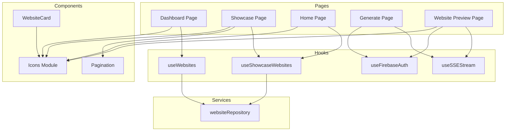

# Technical Design Document

## Overview

This document describes the technical design for refactoring duplicated code patterns across the AI Website Generator codebase into reusable custom hooks and shared components. The refactoring targets six primary areas of duplication:

1. **Icon Components** - SVG icons duplicated across 6+ files
2. **Website Fetching (User-owned)** - Pagination and fetch logic in Dashboard
3. **Website Fetching (Showcased)** - Pagination and fetch logic in Showcase and Home pages
4. **SSE Stream Processing** - Server-Sent Events parsing in Generate and Website Preview pages
5. **Firebase Auth Token Retrieval** - `getIdToken` function duplicated in multiple files
6. **Pagination Component** - Inline Pagination in Showcase page duplicating shared component

The design follows React best practices for custom hooks, maintains backward compatibility with existing functionality, and ensures all existing tests continue to pass.

## Architecture

### High-Level Architecture

```
┌─────────────────────────────────────────────────────────────────┐
│                         Application Layer                        │
├─────────────────────────────────────────────────────────────────┤
│  Pages                                                           │
│  ├── Dashboard       (uses useWebsites, Icons)                  │
│  ├── Showcase        (uses useShowcaseWebsites, Pagination)     │
│  ├── Home            (uses useShowcaseWebsites, Icons)          │
│  ├── Generate        (uses useSSEStream, useFirebaseAuth)       │
│  └── Website Preview (uses useSSEStream, useFirebaseAuth, Icons)│
├─────────────────────────────────────────────────────────────────┤
│  Components                                                      │
│  ├── WebsiteCard     (uses Icons)                               │
│  ├── Pagination      (shared component)                          │
│  └── Icons Module    (shared icon components)                    │
├─────────────────────────────────────────────────────────────────┤
│  Custom Hooks                                                    │
│  ├── useWebsites          (website fetching + pagination)       │
│  ├── useShowcaseWebsites  (showcase fetching + pagination)      │
│  ├── useSSEStream         (SSE stream processing)               │
│  └── useFirebaseAuth      (auth utilities + getIdToken)         │
├─────────────────────────────────────────────────────────────────┤
│  Services                                                        │
│  └── websiteRepository    (Firestore operations)                │
└─────────────────────────────────────────────────────────────────┘
```

### Dependency Flow



## Components and Interfaces

### 1. Icons Module

**Location:** `src/components/icons/index.ts`

The Icons Module centralizes all shared SVG icon components, eliminating duplication across files.

```typescript
/**
 * Icon component props interface
 * All icons accept optional className for styling customization
 */
export interface IconProps {
  /** Optional CSS class name for styling */
  className?: string;
}

/**
 * Globe icon for showcase and navigation
 */
export function GlobeIcon({ className }: IconProps): JSX.Element;

/**
 * Chevron left icon for pagination previous
 */
export function ChevronLeftIcon({ className }: IconProps): JSX.Element;

/**
 * Chevron right icon for pagination next
 */
export function ChevronRightIcon({ className }: IconProps): JSX.Element;

/**
 * Arrow left icon for back navigation
 */
export function ArrowLeftIcon({ className }: IconProps): JSX.Element;

/**
 * Arrow right icon for forward navigation
 */
export function ArrowRightIcon({ className }: IconProps): JSX.Element;

/**
 * Check icon for confirmations and saved state
 */
export function CheckIcon({ className }: IconProps): JSX.Element;

/**
 * X icon for close/cancel actions
 */
export function XIcon({ className }: IconProps): JSX.Element;

/**
 * Trash icon for delete actions
 */
export function TrashIcon({ className }: IconProps): JSX.Element;

/**
 * Edit/pencil icon for editing actions
 */
export function EditIcon({ className }: IconProps): JSX.Element;

/**
 * Text/document icon for text input indicator
 */
export function TextIcon({ className }: IconProps): JSX.Element;

/**
 * Image icon for screenshot input indicator
 */
export function ImageIcon({ className }: IconProps): JSX.Element;

/**
 * Sparkles icon for beautify feature
 */
export function SparklesIcon({ className }: IconProps): JSX.Element;

/**
 * Download icon for download actions
 */
export function DownloadIcon({ className }: IconProps): JSX.Element;

/**
 * Code icon for code editor toggle
 */
export function CodeIcon({ className }: IconProps): JSX.Element;

/**
 * Panel left icon for collapse actions
 */
export function PanelLeftIcon({ className }: IconProps): JSX.Element;

/**
 * Panel right icon for expand actions
 */
export function PanelRightIcon({ className }: IconProps): JSX.Element;

/**
 * Maximize icon for fullscreen
 */
export function MaximizeIcon({ className }: IconProps): JSX.Element;

/**
 * Minimize icon for exit fullscreen
 */
export function MinimizeIcon({ className }: IconProps): JSX.Element;

/**
 * Plus icon for add/create actions
 */
export function PlusIcon({ className }: IconProps): JSX.Element;
```

**Implementation Notes:**
- All icons include `aria-hidden="true"` for accessibility
- Icons use `currentColor` for stroke to inherit text color
- SVG viewBox is standardized to "0 0 24 24"
- strokeWidth, strokeLinecap, and strokeLinejoin are consistent

### 2. useWebsites Hook

**Location:** `src/hooks/useWebsites.ts`

Custom hook for fetching user-owned websites with pagination support.

```typescript
/**
 * Return type for the useWebsites hook
 */
export interface UseWebsitesReturn {
  /** Array of websites for the current page */
  items: GeneratedWebsite[];
  /** Whether data is currently being fetched */
  isLoading: boolean;
  /** Error message if fetch failed, null otherwise */
  error: string | null;
  /** Current page number (1-indexed) */
  currentPage: number;
  /** Total number of pages */
  totalPages: number;
  /** Function to fetch a specific page */
  fetchPage: (page: number) => Promise<void>;
  /** Function to refresh the current page */
  refresh: () => Promise<void>;
}

/**
 * Options for the useWebsites hook
 */
export interface UseWebsitesOptions {
  /** Number of items per page (default: 12) */
  pageSize?: number;
}

/**
 * Hook for fetching user-owned websites with pagination
 *
 * @param userId - Firebase Auth UID of the website owner
 * @param options - Optional configuration (pageSize)
 * @returns Object with items, loading state, error, pagination info, and control functions
 *
 * @example
 * ```tsx
 * function Dashboard() {
 *   const { user } = useAuth();
 *   const { items, isLoading, error, currentPage, totalPages, fetchPage, refresh } =
 *     useWebsites(user?.uid ?? '', { pageSize: 12 });
 *
 *   if (isLoading) return <LoadingSpinner />;
 *   if (error) return <ErrorMessage message={error} onRetry={refresh} />;
 *
 *   return (
 *     <>
 *       <WebsiteGrid websites={items} />
 *       <Pagination
 *         currentPage={currentPage}
 *         totalPages={totalPages}
 *         onPageChange={fetchPage}
 *       />
 *     </>
 *   );
 * }
 * ```
 */
export function useWebsites(
  userId: string,
  options?: UseWebsitesOptions
): UseWebsitesReturn;
```

**Implementation Details:**
- Uses `websiteRepository.getAllByUser()` for data fetching
- Initial fetch triggered on mount when userId is truthy
- Manages loading, error, and pagination state internally
- `fetchPage` updates currentPage and triggers new fetch
- `refresh` re-fetches current page without changing page number

### 3. useShowcaseWebsites Hook

**Location:** `src/hooks/useShowcaseWebsites.ts`

Custom hook for fetching showcased websites with pagination support.

```typescript
/**
 * Return type for the useShowcaseWebsites hook
 */
export interface UseShowcaseWebsitesReturn {
  /** Array of showcased websites for the current page */
  items: ShowcasedWebsite[];
  /** Whether data is currently being fetched */
  isLoading: boolean;
  /** Error message if fetch failed, null otherwise */
  error: string | null;
  /** Current page number (1-indexed) */
  currentPage: number;
  /** Total number of pages */
  totalPages: number;
  /** Total count of all showcased websites */
  totalCount: number;
  /** Function to fetch a specific page */
  fetchPage: (page: number) => Promise<void>;
  /** Function to refresh the current page */
  refresh: () => Promise<void>;
}

/**
 * Options for the useShowcaseWebsites hook
 */
export interface UseShowcaseWebsitesOptions {
  /** Number of items per page (default: 12) */
  pageSize?: number;
}

/**
 * Hook for fetching showcased websites with pagination
 *
 * @param options - Optional configuration (pageSize)
 * @returns Object with items, loading state, error, pagination info, and control functions
 *
 * @example
 * ```tsx
 * // Full showcase page with pagination
 * function ShowcasePage() {
 *   const { items, isLoading, totalPages, currentPage, fetchPage } =
 *     useShowcaseWebsites({ pageSize: 12 });
 *   // ...
 * }
 *
 * // Home page preview with limited items
 * function CommunityShowcase() {
 *   const { items, isLoading } = useShowcaseWebsites({ pageSize: 6 });
 *   // ...
 * }
 * ```
 */
export function useShowcaseWebsites(
  options?: UseShowcaseWebsitesOptions
): UseShowcaseWebsitesReturn;
```

**Implementation Details:**
- Uses `websiteRepository.getShowcasedWebsites()` for data fetching
- Automatically fetches first page on mount
- Returns `totalCount` for displaying "X of Y websites" info
- Same pattern as `useWebsites` for consistency

### 4. useSSEStream Hook

**Location:** `src/hooks/useSSEStream.ts`

Custom hook for processing Server-Sent Events streams with abort capability.

```typescript
/**
 * SSE event structure parsed from the stream
 */
export interface SSEEvent {
  /** Event type (e.g., 'start', 'text', 'done', 'error') */
  type: string;
  /** Parsed JSON data from the event */
  data: unknown;
}

/**
 * Configuration for the useSSEStream hook
 */
export interface UseSSEStreamConfig {
  /** API endpoint URL */
  url: string;
  /** HTTP method (typically 'POST') */
  method: string;
  /** Request headers (including Authorization) */
  headers: Record<string, string>;
  /** Request body (will be JSON stringified) */
  body: unknown;
  /** Callback invoked for each parsed SSE event */
  onEvent: (event: SSEEvent) => void;
}

/**
 * Return type for the useSSEStream hook
 */
export interface UseSSEStreamReturn {
  /** Whether streaming is currently active */
  isStreaming: boolean;
  /** Error message if streaming failed, null otherwise */
  error: string | null;
  /** Accumulated streaming content (for preview) */
  streamingContent: string;
  /** Function to start the stream */
  start: () => Promise<void>;
  /** Function to cancel the ongoing stream */
  cancel: () => void;
}

/**
 * Hook for processing Server-Sent Events streams
 *
 * @param config - Stream configuration with URL, method, headers, body, and event handler
 * @returns Object with streaming state, error, content, and control functions
 *
 * @example
 * ```tsx
 * function GeneratePage() {
 *   const [result, setResult] = useState(null);
 *
 *   const { isStreaming, error, streamingContent, start, cancel } = useSSEStream({
 *     url: '/api/generate/stream',
 *     method: 'POST',
 *     headers: { 'Content-Type': 'application/json', Authorization: `Bearer ${token}` },
 *     body: { type: 'text', description: prompt },
 *     onEvent: (event) => {
 *       if (event.type === 'done') {
 *         setResult(event.data.result);
 *       }
 *     },
 *   });
 *
 *   return (
 *     <div>
 *       {isStreaming && <LoadingOverlay onCancel={cancel} />}
 *       {streamingContent && <StreamPreview content={streamingContent} />}
 *     </div>
 *   );
 * }
 * ```
 */
export function useSSEStream(config: UseSSEStreamConfig): UseSSEStreamReturn;
```

**Implementation Details:**
- Uses `AbortController` for cancellation support
- Parses SSE format: `event: {type}\ndata: {json}\n\n`
- Handles buffer for incomplete lines during streaming
- Distinguishes between abort errors (no error state) and other errors
- Accumulates `streamingContent` for live preview display

### 5. useFirebaseAuth Hook Enhancement

**Location:** Integrated into `src/components/auth/AuthProvider.tsx` (extends existing `useAuth`)

Enhances the existing `useAuth` hook to include the `getIdToken` utility function.

```typescript
/**
 * Extended AuthContextValue with getIdToken function
 */
interface AuthContextValue extends AuthState {
  /** Sign in with Google OAuth */
  signInWithGoogle: () => Promise<void>;
  /** Sign out the current user */
  signOut: () => Promise<void>;
  /** Clear any auth errors */
  clearError: () => void;
  /**
   * Get the current user's Firebase ID token
   * @throws Error with message "User not authenticated" if no user is signed in
   * @returns Promise resolving to the ID token string
   */
  getIdToken: () => Promise<string>;
}

/**
 * Hook providing authentication state and utilities
 *
 * @throws Error if used outside of AuthProvider
 * @returns AuthContextValue with auth state, actions, and utilities
 *
 * @example
 * ```tsx
 * function ProtectedApiCall() {
 *   const { getIdToken } = useAuth();
 *
 *   const fetchData = async () => {
 *     const token = await getIdToken();
 *     const response = await fetch('/api/data', {
 *       headers: { Authorization: `Bearer ${token}` },
 *     });
 *     // ...
 *   };
 * }
 * ```
 */
export function useAuth(): AuthContextValue;
```

**Implementation Details:**
- `getIdToken` calls `auth.currentUser?.getIdToken()`
- Throws descriptive error if no user is authenticated
- Memoized to maintain stable reference
- Integrated into existing `AuthContext` to avoid breaking changes

## Data Models

### Existing Types (No Changes)

The refactoring reuses existing type definitions from `src/types/website.ts`:

```typescript
// GeneratedWebsite - Full website data for user-owned websites
interface GeneratedWebsite {
  id: string;
  userId: string;
  title: string;
  html: string;
  css: string;
  thumbnailUrl: string;
  inputType: 'text' | 'screenshot';
  originalPrompt: string | null;
  isPublic: boolean;
  isShowcased: boolean;
  showcasedAt: string | null;
  creatorName: string;
  createdAt: string;
  updatedAt: string;
}

// ShowcasedWebsite - Minimal data for showcase display
interface ShowcasedWebsite {
  id: string;
  title: string;
  thumbnailUrl: string;
  creatorName: string;
  showcasedAt: string;
}
```

### New Types

```typescript
// Icon props (src/components/icons/index.ts)
interface IconProps {
  className?: string;
}

// SSE Event (src/hooks/useSSEStream.ts)
interface SSEEvent {
  type: string;
  data: unknown;
}

// Hook return types as defined in Components and Interfaces section
```

## Correctness Properties

*A property is a characteristic or behavior that should hold true across all valid executions of a system—essentially, a formal statement about what the system should do. Properties serve as the bridge between human-readable specifications and machine-verifiable correctness guarantees.*

### Property 1: Icon Component Accessibility

*For any* icon component from the Icons_Module, when rendered with any valid className string, the resulting SVG element SHALL have the `aria-hidden="true"` attribute and SHALL include the provided className in its class attribute.

**Validates: Requirements 1.2, 1.3**

### Property 2: useWebsites Return Structure

*For any* valid userId string, the `useWebsites` hook SHALL return an object containing all required fields: `items` (array), `isLoading` (boolean), `error` (string | null), `currentPage` (number), `totalPages` (number), `fetchPage` (function), and `refresh` (function).

**Validates: Requirements 2.3**

### Property 3: useWebsites Pagination Behavior

*For any* valid page number within the range [1, totalPages], when `fetchPage` is called with that page number, the hook SHALL update `currentPage` to match the requested page and trigger a fetch that updates `items` with the corresponding page of websites.

**Validates: Requirements 2.4**

### Property 4: useShowcaseWebsites Return Structure

*For any* invocation of the `useShowcaseWebsites` hook with valid options, the hook SHALL return an object containing all required fields: `items` (array), `isLoading` (boolean), `error` (string | null), `currentPage` (number), `totalPages` (number), `totalCount` (number), `fetchPage` (function), and `refresh` (function).

**Validates: Requirements 3.3**

### Property 5: useShowcaseWebsites Pagination Behavior

*For any* valid page number within the range [1, totalPages], when `fetchPage` is called with that page number, the hook SHALL update state correctly with the corresponding page of showcased websites.

**Validates: Requirements 3.4**

### Property 6: useSSEStream Return Structure

*For any* valid SSEStreamConfig, the `useSSEStream` hook SHALL return an object containing all required fields: `isStreaming` (boolean), `error` (string | null), `streamingContent` (string), `start` (function), and `cancel` (function).

**Validates: Requirements 4.2**

### Property 7: SSE Event Parsing

*For any* valid SSE event in the format `event: {type}\ndata: {json}`, the `useSSEStream` hook SHALL correctly parse the event type and data, and invoke the `onEvent` callback with the parsed `SSEEvent` object containing the correct `type` and `data` fields.

**Validates: Requirements 4.4**

## Error Handling

### Hook Error States

All custom hooks follow a consistent error handling pattern:

```typescript
// Error state in hook return
{
  isLoading: false,
  error: string | null,  // Descriptive error message
  // ... other fields
}
```

**Error Scenarios:**

1. **Network Errors (useWebsites, useShowcaseWebsites)**
   - Repository fetch fails → Set `error` with message, `isLoading: false`
   - Retry available via `refresh()` function

2. **Authentication Errors (useFirebaseAuth.getIdToken)**
   - No authenticated user → Throw `Error("User not authenticated")`
   - Token refresh fails → Propagate Firebase error

3. **Stream Errors (useSSEStream)**
   - Network failure → Set `error` with message, `isStreaming: false`
   - Parse error → Skip malformed events, continue processing
   - User cancellation (abort) → Reset state without setting error
   - Server error event → Set `error` from event data

### Error Recovery

```typescript
// Pattern for error recovery with retry
function Component() {
  const { error, refresh } = useWebsites(userId);

  if (error) {
    return (
      <ErrorMessage
        message={error}
        onRetry={refresh}  // Re-attempts the fetch
      />
    );
  }
}
```

### Loading State During Retry

For hooks with automatic retry behavior (if implemented), the requirements specify:
- During automatic retry: `isLoading: true` until retry completes or permanently fails
- Manual retry via `refresh()`: Sets `isLoading: true` immediately

## Testing Strategy

### Unit Testing Approach

The testing strategy employs both example-based unit tests and property-based tests to ensure comprehensive coverage.

#### 1. Icons Module Tests (`src/components/icons/icons.test.tsx`)

**Example-based tests:**
- All expected icons are exported from the module
- File exists at correct location

**Property-based tests (using fast-check):**
- For any icon component, rendering produces valid SVG with aria-hidden="true"
- For any className string, the class is applied to the SVG element

```typescript
// Feature: code-deduplication-hooks, Property 1: Icon Component Accessibility
import fc from 'fast-check';
import { render } from '@testing-library/react';
import * as Icons from './index';

describe('Icon Components - Property Tests', () => {
  const iconComponents = Object.entries(Icons).filter(
    ([name]) => name.endsWith('Icon')
  );

  test.each(iconComponents)(
    '%s accepts className and has aria-hidden',
    (name, IconComponent) => {
      fc.assert(
        fc.property(fc.string(), (className) => {
          const { container } = render(<IconComponent className={className} />);
          const svg = container.querySelector('svg');
          expect(svg).toHaveAttribute('aria-hidden', 'true');
          if (className) {
            expect(svg).toHaveClass(className);
          }
        }),
        { numRuns: 100 }
      );
    }
  );
});
```

#### 2. useWebsites Hook Tests (`src/hooks/useWebsites.test.ts`)

**Example-based tests:**
- Hook accepts userId and optional pageSize with default of 12
- Initial fetch triggered on mount with correct userId
- Error state set when fetch fails
- Refresh re-fetches current page

**Property-based tests:**
- Return structure contains all required fields
- Pagination updates state correctly for valid page numbers

```typescript
// Feature: code-deduplication-hooks, Property 2: useWebsites Return Structure
describe('useWebsites - Property Tests', () => {
  test('returns all required fields for any userId', () => {
    fc.assert(
      fc.property(fc.string(), async (userId) => {
        const { result } = renderHook(() => useWebsites(userId));

        expect(result.current).toHaveProperty('items');
        expect(result.current).toHaveProperty('isLoading');
        expect(result.current).toHaveProperty('error');
        expect(result.current).toHaveProperty('currentPage');
        expect(result.current).toHaveProperty('totalPages');
        expect(result.current).toHaveProperty('fetchPage');
        expect(result.current).toHaveProperty('refresh');

        expect(Array.isArray(result.current.items)).toBe(true);
        expect(typeof result.current.isLoading).toBe('boolean');
        expect(typeof result.current.fetchPage).toBe('function');
        expect(typeof result.current.refresh).toBe('function');
      }),
      { numRuns: 100 }
    );
  });
});
```

#### 3. useShowcaseWebsites Hook Tests (`src/hooks/useShowcaseWebsites.test.ts`)

**Example-based tests:**
- Hook accepts optional pageSize with default of 12
- Initial fetch triggered on mount
- Error handling works correctly

**Property-based tests:**
- Return structure contains all required fields including totalCount
- Pagination behavior for valid page numbers

#### 4. useSSEStream Hook Tests (`src/hooks/useSSEStream.test.ts`)

**Example-based tests:**
- Hook accepts config object with all required fields
- Start initiates fetch with correct config
- Cancel aborts ongoing fetch
- Abort doesn't set error state

**Property-based tests:**
- Return structure contains all required fields
- SSE event parsing for valid event formats

```typescript
// Feature: code-deduplication-hooks, Property 7: SSE Event Parsing
describe('useSSEStream - SSE Parsing Property', () => {
  test('correctly parses valid SSE events', () => {
    fc.assert(
      fc.property(
        fc.string(),
        fc.jsonObject(),
        async (eventType, eventData) => {
          const events: SSEEvent[] = [];
          const sseText = `event: ${eventType}\ndata: ${JSON.stringify(eventData)}\n\n`;

          // Mock fetch to return this SSE text
          // Verify onEvent called with { type: eventType, data: eventData }
          // ...
        }
      ),
      { numRuns: 100 }
    );
  });
});
```

#### 5. useFirebaseAuth Enhancement Tests

**Example-based tests:**
- getIdToken returns token when user is authenticated
- getIdToken throws "User not authenticated" when no user

### Integration Tests

Integration tests verify that refactored pages maintain identical behavior:

1. **Dashboard Page** - Verify website grid, pagination, delete, edit functionality
2. **Showcase Page** - Verify showcased websites display, pagination works
3. **Home Page** - Verify CommunityShowcase section displays correctly
4. **Generate Page** - Verify SSE streaming and generation flow
5. **Website Preview Page** - Verify beautify streaming, code editing

### Test Configuration

```typescript
// Minimum 100 iterations per property test
const PROPERTY_TEST_RUNS = 100;

// Test file naming convention
// src/hooks/useWebsites.test.ts
// src/components/icons/icons.test.tsx
```

### Running Tests

```bash
# Run all tests
npm test

# Run with coverage
npm test -- --coverage

# Run specific hook tests
npm test -- useWebsites
```
