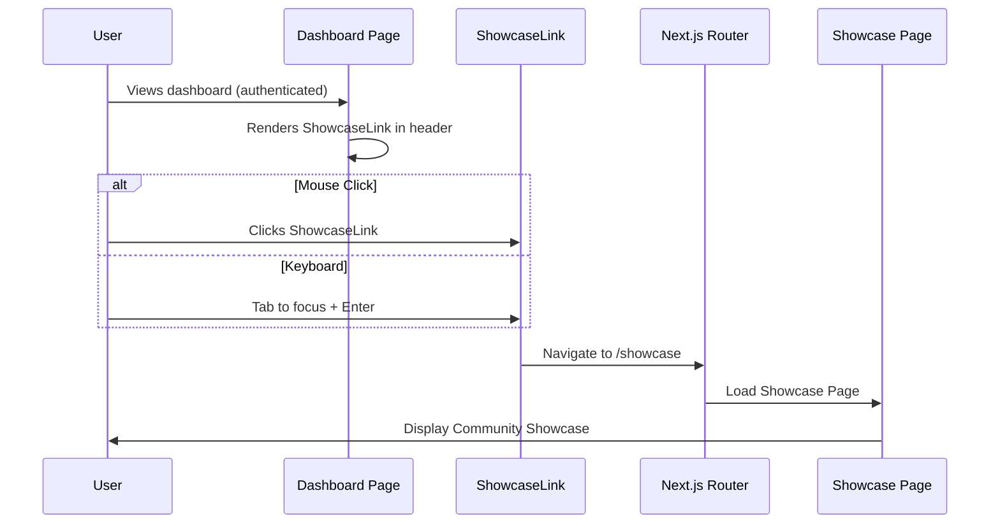

# Technical Design Document: Dashboard Showcase Link

## Overview

This document describes the technical design for adding a Community Showcase navigation link to the dashboard page. The feature enables authenticated users to easily discover and access the Community Showcase (`/showcase`) directly from their dashboard, connecting the private workspace with public community content.

### Goals

- Provide quick, discoverable navigation to the Community Showcase from the dashboard
- Maintain consistency with existing dashboard design patterns and styling
- Ensure full accessibility compliance (WCAG AA)
- Support responsive design across desktop, tablet, and mobile viewports

### Non-Goals

- Modifying the Community Showcase page itself
- Adding showcase-related data or statistics to the dashboard
- Creating a preview or summary of showcased content on the dashboard

## Architecture

### Component Placement Strategy

The showcase link will be integrated directly into the dashboard page (`src/app/dashboard/page.tsx`) rather than the global `AppHeader` component. This decision is based on:

1. **Scope**: The link is dashboard-specific, not needed on other pages
2. **Positioning**: The link needs to be between the page title and "New Website" button, which are in the dashboard's main content area
3. **Existing Pattern**: The dashboard already manages its own header area with title and actions

```
┌──────────────────────────────────────────────────────────────────┐
│ AppHeader (global - logo, theme toggle, user profile, sign out)  │
├──────────────────────────────────────────────────────────────────┤
│ Dashboard Content                                                 │
│ ┌──────────────────────────────────────────────────────────────┐ │
│ │ Page Header Section                                          │ │
│ │ ┌────────────────┐  ┌──────────────────┐  ┌───────────────┐ │ │
│ │ │ Title Section  │  │ Showcase Link    │  │ New Website   │ │ │
│ │ │ "My Websites"  │  │ (NEW COMPONENT)  │  │ Button        │ │ │
│ │ └────────────────┘  └──────────────────┘  └───────────────┘ │ │
│ └──────────────────────────────────────────────────────────────┘ │
│                                                                   │
│ ┌──────────────────────────────────────────────────────────────┐ │
│ │ Website Grid                                                 │ │
│ └──────────────────────────────────────────────────────────────┘ │
└──────────────────────────────────────────────────────────────────┘
```

### Technology Stack

- **Framework**: Next.js with App Router
- **Styling**: Tailwind CSS with custom CSS variables from `globals.css`
- **Routing**: Next.js `Link` component for client-side navigation
- **Icons**: Inline SVG components (consistent with existing pattern)

## Components and Interfaces

### ShowcaseLink Component

A new inline component within the dashboard page that renders the showcase navigation link.

```typescript
/**
 * ShowcaseLink Component
 * Renders a navigation link to the Community Showcase page
 *
 * Requirements:
 * - 1.1-1.5: Display visible link with icon and text in header area
 * - 2.1-2.2: Navigate to /showcase in same tab on click
 * - 3.1-3.4: Full keyboard and screen reader accessibility
 * - 4.1-4.4: Responsive behavior across viewport sizes
 */
interface ShowcaseLinkProps {
  /** Optional CSS class for additional styling */
  className?: string;
}
```

### GlobeIcon Component

Reuses the existing `GlobeIcon` pattern from the showcase page for visual consistency.

```typescript
/**
 * GlobeIcon Component
 * SVG icon representing the Community Showcase
 *
 * Requirements:
 * - 1.3: Visual icon for recognizability
 * - 3.4: aria-hidden="true" to prevent redundant announcements
 */
interface GlobeIconProps {
  className?: string;
}
```

### Component Structure

```tsx
function ShowcaseLink({ className }: ShowcaseLinkProps) {
  return (
    <Link
      href="/showcase"
      className={cn(baseStyles, responsiveStyles, className)}
      aria-label="Navigate to Community Showcase"
    >
      <GlobeIcon className="h-4 w-4" aria-hidden="true" />
      <span className="hidden sm:inline">Community Showcase</span>
      <span className="sr-only sm:hidden">Community Showcase</span>
    </Link>
  );
}
```

## Data Models

This feature does not introduce new data models. It uses:

- Existing authenticated user state from `useAuth()` hook
- Next.js routing for navigation

## Error Handling

### Navigation Errors

| Scenario | Handling |
|----------|----------|
| `/showcase` route unavailable | Next.js default 404 error page |
| Network error during navigation | Browser's default network error handling |
| User not authenticated | N/A - Dashboard is already protected, link always accessible when on dashboard |

### Graceful Degradation

- If JavaScript fails to load, the `<Link>` component falls back to a standard `<a>` tag
- The link remains functional as a basic HTML anchor element

## Testing Strategy

### Overview

This feature primarily involves UI components and navigation behavior. Based on the prework analysis, all acceptance criteria are best tested with **example-based unit tests** and **integration tests** rather than property-based tests. The criteria test specific UI presence, specific behaviors, and specific attribute values—none involve universal properties that vary meaningfully across a wide input space.

### Unit Tests

#### Component Rendering Tests

```typescript
describe('ShowcaseLink', () => {
  it('renders a visible link in the dashboard header area (Req 1.1)', () => {
    render(<DashboardPage />);
    expect(screen.getByRole('link', { name: /community showcase/i })).toBeVisible();
  });

  it('displays text that identifies destination as Community Showcase (Req 1.2)', () => {
    render(<ShowcaseLink />);
    expect(screen.getByText(/community showcase/i)).toBeInTheDocument();
  });

  it('includes a globe icon for visual recognition (Req 1.3)', () => {
    render(<ShowcaseLink />);
    const icon = document.querySelector('svg');
    expect(icon).toBeInTheDocument();
  });

  it('positions link between title and New Website button (Req 1.4)', () => {
    render(<DashboardPage />);
    const header = screen.getByRole('banner') || document.querySelector('[class*="mb-8"]');
    const elements = header?.querySelectorAll('h1, a[href="/showcase"], a[href="/generate"]');
    // Verify DOM order: title, showcase link, new website button
    expect(elements?.[0]?.textContent).toMatch(/my websites/i);
    expect(elements?.[1]?.getAttribute('href')).toBe('/showcase');
    expect(elements?.[2]?.getAttribute('href')).toBe('/generate');
  });

  it('uses secondary/link styling consistent with design system (Req 1.5)', () => {
    render(<ShowcaseLink />);
    const link = screen.getByRole('link', { name: /community showcase/i });
    expect(link).toHaveClass('text-muted-foreground');
  });
});
```

#### Navigation Tests

```typescript
describe('ShowcaseLink Navigation', () => {
  it('navigates to /showcase route on click (Req 2.1)', async () => {
    const user = userEvent.setup();
    render(<ShowcaseLink />);

    const link = screen.getByRole('link', { name: /community showcase/i });
    expect(link).toHaveAttribute('href', '/showcase');
  });

  it('opens in same tab without target="_blank" (Req 2.2)', () => {
    render(<ShowcaseLink />);
    const link = screen.getByRole('link', { name: /community showcase/i });
    expect(link).not.toHaveAttribute('target', '_blank');
  });
});
```

#### Accessibility Tests

```typescript
describe('ShowcaseLink Accessibility', () => {
  it('is keyboard focusable via Tab key (Req 3.1)', async () => {
    const user = userEvent.setup();
    render(<ShowcaseLink />);

    await user.tab();
    expect(screen.getByRole('link', { name: /community showcase/i })).toHaveFocus();
  });

  it('has descriptive accessible name for screen readers (Req 3.2)', () => {
    render(<ShowcaseLink />);
    const link = screen.getByRole('link');
    expect(link).toHaveAccessibleName(/community showcase|navigate to community showcase/i);
  });

  it('displays visible focus indicator on keyboard focus (Req 3.3)', async () => {
    const user = userEvent.setup();
    render(<ShowcaseLink />);

    const link = screen.getByRole('link', { name: /community showcase/i });
    await user.tab();
    expect(link).toHaveClass('focus-visible:ring-2');
  });

  it('has aria-hidden on icon to prevent redundant announcements (Req 3.4)', () => {
    render(<ShowcaseLink />);
    const icon = document.querySelector('svg');
    expect(icon).toHaveAttribute('aria-hidden', 'true');
  });
});
```

#### Responsive Behavior Tests

```typescript
describe('ShowcaseLink Responsive Behavior', () => {
  it('displays icon and full text at desktop size (1024px+) (Req 4.1)', () => {
    // Set viewport to desktop
    global.innerWidth = 1024;
    render(<ShowcaseLink />);

    const icon = document.querySelector('svg');
    const text = screen.getByText(/community showcase/i);
    expect(icon).toBeVisible();
    expect(text).toBeVisible();
  });

  it('displays icon and text at tablet size (768-1023px) (Req 4.2)', () => {
    global.innerWidth = 800;
    render(<ShowcaseLink />);

    const icon = document.querySelector('svg');
    const text = screen.getByText(/community showcase/i);
    expect(icon).toBeVisible();
    expect(text).toBeVisible();
  });

  it('displays icon with accessible text at mobile size (<768px) (Req 4.3)', () => {
    global.innerWidth = 375;
    render(<ShowcaseLink />);

    const icon = document.querySelector('svg');
    const link = screen.getByRole('link');
    expect(icon).toBeVisible();
    expect(link).toHaveAccessibleName(/community showcase/i);
  });

  it('maintains minimum 44x44px touch target on mobile (Req 4.4)', () => {
    global.innerWidth = 375;
    render(<ShowcaseLink />);

    const link = screen.getByRole('link', { name: /community showcase/i });
    const styles = window.getComputedStyle(link);
    // Verify minimum touch target via padding/min-height/min-width
    expect(link.classList.toString()).toMatch(/min-h-\[44px\]|p-3|py-3/);
  });
});
```

### Integration Tests

```typescript
describe('Dashboard Showcase Link Integration', () => {
  it('authenticated user sees showcase link on dashboard (Req 1.1)', async () => {
    // Mock authenticated user
    mockAuthContext({ user: mockUser });
    render(<DashboardPage />);

    await waitFor(() => {
      expect(screen.getByRole('link', { name: /community showcase/i })).toBeInTheDocument();
    });
  });

  it('navigating to showcase loads the page successfully (Req 2.3)', async () => {
    // End-to-end style test
    const { router } = renderWithRouter(<DashboardPage />);

    const link = screen.getByRole('link', { name: /community showcase/i });
    await userEvent.click(link);

    expect(router.pathname).toBe('/showcase');
  });
});
```

### Test Coverage Summary

| Requirement | Test Type | Coverage |
|-------------|-----------|----------|
| 1.1-1.5 | Unit (Example) | Component rendering, DOM structure, styling |
| 2.1-2.2 | Unit (Example) | Link href, target attribute |
| 2.3-2.4 | Integration | Page load, error handling |
| 3.1-3.4 | Unit (Example) | Focusability, aria attributes, focus styles |
| 4.1-4.4 | Unit (Example) | Responsive visibility, touch targets |

### Why Not Property-Based Testing

Based on the prework analysis, property-based testing is **not appropriate** for this feature because:

1. **No universal properties**: All requirements test specific UI states, specific attribute values, or specific behaviors—not properties that hold across varying inputs
2. **Fixed outputs**: The component always renders the same structure regardless of input
3. **UI-focused**: This is a static navigation component with no data transformation logic
4. **No meaningful input variation**: There's no input space to explore—the component either renders correctly or it doesn't

Example-based unit tests provide complete coverage for these requirements.


## Implementation Details

### File Changes

#### 1. `src/app/dashboard/page.tsx`

Add the ShowcaseLink component and integrate it into the page header.

**Changes:**
- Add `GlobeIcon` component (reuse pattern from showcase page)
- Add `ShowcaseLink` component
- Update page header to include the showcase link between title and "New Website" button

```tsx
/**
 * Globe icon for showcase link
 * Requirement 1.3: Visual icon for recognizability
 * Requirement 3.4: aria-hidden to prevent redundant announcements
 */
function GlobeIcon({ className }: { className?: string }) {
  return (
    <svg
      xmlns="http://www.w3.org/2000/svg"
      viewBox="0 0 24 24"
      fill="none"
      stroke="currentColor"
      strokeWidth={2}
      strokeLinecap="round"
      strokeLinejoin="round"
      className={className}
      aria-hidden="true"
    >
      <circle cx="12" cy="12" r="10" />
      <path d="M12 2a14.5 14.5 0 0 0 0 20 14.5 14.5 0 0 0 0-20" />
      <path d="M2 12h20" />
    </svg>
  );
}

/**
 * ShowcaseLink Component
 * Navigation link to the Community Showcase page
 *
 * Requirements:
 * - 1.1: Display visible link in dashboard header
 * - 1.2: Text clearly identifies destination
 * - 1.3: Include visual icon (globe)
 * - 1.5: Secondary/link styling
 * - 2.1: Navigate to /showcase
 * - 2.2: Open in same tab
 * - 3.1: Keyboard accessible
 * - 3.2: Descriptive accessible name
 * - 3.3: Visible focus indicator
 * - 4.1-4.3: Responsive text/icon display
 * - 4.4: Minimum touch target size
 */
function ShowcaseLink() {
  return (
    <a
      href="/showcase"
      className="
        inline-flex items-center justify-center gap-2
        rounded-md px-3 py-2
        min-h-[44px] min-w-[44px]
        text-sm font-medium
        text-muted-foreground
        hover:bg-accent hover:text-accent-foreground
        focus-visible:outline-none focus-visible:ring-2 focus-visible:ring-ring
        transition-colors
      "
      aria-label="Navigate to Community Showcase"
    >
      <GlobeIcon className="h-4 w-4" />
      <span className="hidden sm:inline">Community Showcase</span>
    </a>
  );
}
```

**Updated Page Header Structure:**

```tsx
{/* Page header - Requirement 1.4: Position between title and New Website button */}
<div className="mb-8 flex flex-wrap items-center justify-between gap-4">
  {/* Title section */}
  <div>
    <h1 className="text-2xl font-bold text-foreground">My Websites</h1>
    <p className="text-muted-foreground text-sm mt-1">
      Manage and view your generated websites
    </p>
  </div>

  {/* Action buttons section */}
  <div className="flex items-center gap-2">
    {/* Showcase link - Requirement 1.4: Between title and New Website */}
    <ShowcaseLink />

    {/* New Website button */}
    <a
      href="/generate"
      className="
        inline-flex items-center justify-center gap-2
        rounded-md bg-primary px-4 py-2
        text-sm font-medium text-primary-foreground
        hover:bg-primary/90
        focus-visible:outline-none focus-visible:ring-2 focus-visible:ring-ring
        transition-colors
      "
    >
      <svg
        xmlns="http://www.w3.org/2000/svg"
        viewBox="0 0 24 24"
        fill="none"
        stroke="currentColor"
        strokeWidth={2}
        strokeLinecap="round"
        strokeLinejoin="round"
        className="h-4 w-4"
        aria-hidden="true"
      >
        <path d="M12 5v14" />
        <path d="M5 12h14" />
      </svg>
      New Website
    </a>
  </div>
</div>
```

### Styling Specifications

#### Design Tokens Used

| Token | Purpose | Light Value | Dark Value |
|-------|---------|-------------|------------|
| `text-muted-foreground` | Link text color | `#525252` | `#a1a1aa` |
| `hover:bg-accent` | Hover background | `#f4f4f5` | `#27272a` |
| `hover:text-accent-foreground` | Hover text | `#18181b` | `#fafafa` |
| `focus-visible:ring-ring` | Focus ring | `#2563eb` | `#60a5fa` |

#### Responsive Breakpoints

| Viewport | Width | Icon | Text |
|----------|-------|------|------|
| Mobile | < 640px | ✓ Visible | Hidden (sr-only) |
| Tablet | 640px - 1023px | ✓ Visible | ✓ Visible |
| Desktop | ≥ 1024px | ✓ Visible | ✓ Visible |

#### Touch Target Compliance

```css
/* Minimum touch target: 44x44px (WCAG 2.1 Level AAA, recommended) */
min-h-[44px] min-w-[44px]
/* Additional padding for comfortable touch */
px-3 py-2
```

### Accessibility Checklist

| Requirement | Implementation |
|-------------|----------------|
| Keyboard focusable | Native `<a>` element, no `tabindex` modification needed |
| Accessible name | `aria-label="Navigate to Community Showcase"` |
| Focus indicator | `focus-visible:ring-2 focus-visible:ring-ring` |
| Icon hidden from AT | `aria-hidden="true"` on SVG |
| Color contrast | Uses WCAG AA compliant design tokens |
| Touch target | `min-h-[44px] min-w-[44px]` |

### Mermaid Diagram: Component Integration

```mermaid
graph TD
    subgraph "Dashboard Page"
        A[DashboardPage] --> B[AppHeader]
        A --> C[Page Header Section]
        A --> D[DashboardContent]

        subgraph "Page Header"
            C --> E[Title Section]
            C --> F[Action Buttons]
            F --> G[ShowcaseLink]
            F --> H[New Website Button]
        end

        subgraph "ShowcaseLink"
            G --> I[GlobeIcon]
            G --> J[Link Text]
        end
    end

    G -->|href="/showcase"| K[Showcase Page]
```

### Mermaid Diagram: User Interaction Flow



## Dependencies

### Existing Dependencies (No New Packages Required)

- `next` - Routing and Link component
- `tailwindcss` - Styling utilities
- `react` - Component framework

### Internal Dependencies

- `useAuth` hook - For authenticated user context (already imported in dashboard)
- Design tokens from `globals.css` - Color and styling consistency

## Migration Notes

This is a new feature addition with no breaking changes:

1. No database migrations required
2. No API changes
3. No changes to existing components
4. No configuration changes

## Future Considerations

1. **Badge/Counter**: Could add a notification badge showing new showcase items since last visit
2. **Tooltip**: Could add hover tooltip with brief description of the showcase
3. **Keyboard Shortcut**: Could add a keyboard shortcut (e.g., `G + S`) for power users
4. **A/B Testing**: Could track click-through rate to measure feature adoption
