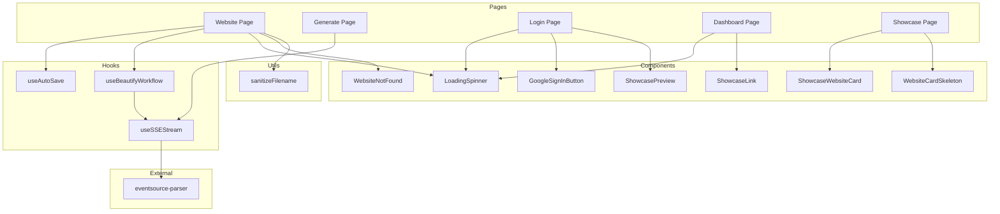

# Technical Design Document: Page Refactoring

## Overview

This design document outlines the technical implementation for refactoring large page components in the ai-website-generator project. The refactoring aims to:

1. Extract inline components to separate reusable files
2. Create custom hooks for reusable stateful logic (useAutoSave, useBeautifyWorkflow)
3. Rewrite the useSSEStream hook to use the eventsource-parser library with enhanced capabilities
4. Reduce all large page files to manageable sizes (under 300-400 lines each)
5. Eliminate duplicate inline components across pages
6. Maintain consistent use of the eventsource-parser library for all SSE parsing

### Current State Analysis

| Page | Current Lines | Target | Primary Issues |
|------|---------------|--------|----------------|
| `website/[id]/page.tsx` | 1212 | <400 | Inline LoadingSpinner, WebsiteNotFound, sanitizeFilename, complex beautify/auto-save logic |
| `generate/page.tsx` | ~600 | <400 | Duplicate SSE streaming code, not using shared useSSEStream hook |
| `page.tsx` (Login) | 461 | <300 | Inline GoogleIcon, GoogleSignInButton, ErrorAlert, ShowcaseCard, CommunityShowcase |
| `dashboard/page.tsx` | 397 | <350 | Inline LoadingSpinner (duplicate), ShowcaseLink |
| `showcase/page.tsx` | 243 | <200 | Inline WebsiteCardSkeleton, EmptyState, WebsiteCard |

## Architecture

The refactoring follows a layered extraction approach:

```
┌─────────────────────────────────────────────────────────────────┐
│                        Page Components                          │
│  (website/[id], generate, login, dashboard, showcase)          │
├─────────────────────────────────────────────────────────────────┤
│                     Custom Hooks Layer                          │
│  useSSEStream │ useAutoSave │ useBeautifyWorkflow              │
├─────────────────────────────────────────────────────────────────┤
│                   Shared Components Layer                       │
│  LoadingSpinner │ WebsiteNotFound │ GoogleSignInButton │ etc.  │
├─────────────────────────────────────────────────────────────────┤
│                      Utilities Layer                            │
│  sanitizeFilename │ (future utilities)                         │
└─────────────────────────────────────────────────────────────────┘
```

### Dependency Flow



## Components and Interfaces

### 1. LoadingSpinner Component

**Location:** `src/components/common/LoadingSpinner.tsx`

```typescript
/**
 * LoadingSpinner component props
 */
export interface LoadingSpinnerProps {
  /** Optional loading message (max 100 characters, defaults to "Loading...") */
  message?: string;
  /** Whether to render at full viewport height (defaults to false) */
  fullScreen?: boolean;
}

/**
 * LoadingSpinner component
 * Displays a centered spinning indicator with optional message
 */
export function LoadingSpinner({
  message = 'Loading...',
  fullScreen = false
}: LoadingSpinnerProps): JSX.Element;
```

**Design Decisions:**
- Message prop truncated to 100 characters to prevent layout issues
- Uses CSS classes for height: `min-h-screen` when fullScreen=true, `min-h-[400px]` otherwise
- Spinner is 40x40 pixels with primary color border and transparent top (creates spinning effect)
- Message displayed below spinner in muted-foreground color

### 2. WebsiteNotFound Component

**Location:** `src/components/common/WebsiteNotFound.tsx`

```typescript
/**
 * WebsiteNotFound component props
 */
export interface WebsiteNotFoundProps {
  /** Optional callback for custom navigation handling */
  onNavigateBack?: () => void;
}

/**
 * WebsiteNotFound component
 * Displays a not-found state with navigation back to dashboard
 */
export function WebsiteNotFound({
  onNavigateBack
}: WebsiteNotFoundProps): JSX.Element;
```

**Design Decisions:**
- Uses Next.js `useRouter` internally for default navigation to `/dashboard`
- Custom callback takes precedence when provided
- Maintains exact visual appearance of original inline implementation
- Icon uses muted background with X symbol SVG

### 3. GoogleSignInButton Component

**Location:** `src/components/auth/GoogleSignInButton.tsx`

```typescript
/**
 * GoogleSignInButton component props
 */
export interface GoogleSignInButtonProps {
  /** Click handler for sign-in action */
  onClick: () => void;
  /** Whether sign-in is in progress */
  isLoading: boolean;
  /** Whether the button should be disabled */
  disabled?: boolean;
}

/**
 * GoogleSignInButton component
 * Renders an accessible Google Sign-In button with loading state
 */
export function GoogleSignInButton({
  onClick,
  isLoading,
  disabled
}: GoogleSignInButtonProps): JSX.Element;
```

**Design Decisions:**
- Includes GoogleIcon component internally (not exported separately)
- Shows spinner animation during loading state
- Uses aria-busy attribute for accessibility
- White background with gray border for official Google appearance

### 4. ShowcasePreview Component

**Location:** `src/components/ShowcasePreview.tsx`

```typescript
/**
 * ShowcasePreview component
 * Displays a preview of community showcased websites for the login page
 * Uses useShowcaseWebsites hook with pageSize of 6
 */
export function ShowcasePreview(): JSX.Element;
```

**Design Decisions:**
- Contains internal ShowcaseCard component for individual website cards
- Fixed pageSize of 6 to match login page requirements
- Includes loading skeleton state
- Includes empty state with CTA

### 5. ShowcaseWebsiteCard Component

**Location:** `src/components/ShowcaseWebsiteCard.tsx`

```typescript
import type { ShowcasedWebsite } from '@/types/website';

/**
 * ShowcaseWebsiteCard component props
 */
export interface ShowcaseWebsiteCardProps {
  /** Website data to display */
  website: ShowcasedWebsite;
}

/**
 * ShowcaseWebsiteCard component
 * Renders a card for a showcased website with thumbnail, title, and creator
 */
export function ShowcaseWebsiteCard({
  website
}: ShowcaseWebsiteCardProps): JSX.Element;
```

**Design Decisions:**
- Links to `/view/{id}` with target="_blank"
- Uses Next.js Image component for optimized thumbnail loading
- Falls back to globe icon when no thumbnail
- Hover effects for interactivity

### 6. WebsiteCardSkeleton Component

**Location:** `src/components/common/WebsiteCardSkeleton.tsx`

```typescript
/**
 * WebsiteCardSkeleton component
 * Renders an animated skeleton placeholder matching WebsiteCard dimensions
 */
export function WebsiteCardSkeleton(): JSX.Element;
```

**Design Decisions:**
- Uses animate-pulse class for skeleton animation
- Matches aspect ratio and spacing of WebsiteCard
- No props required - purely presentational

### 7. ShowcaseLink Component

**Location:** `src/components/layout/ShowcaseLink.tsx`

```typescript
/**
 * ShowcaseLink component
 * Navigation link to the Community Showcase page
 */
export function ShowcaseLink(): JSX.Element;
```

**Design Decisions:**
- Uses anchor tag for navigation to `/showcase`
- Globe icon always visible
- Text hidden on mobile (`hidden sm:inline`)
- Minimum touch target of 44x44px for WCAG compliance

## Data Models

### sanitizeFilename Utility

**Location:** `src/utils/filename.ts`

```typescript
/**
 * Sanitizes a title string for use as a filename
 *
 * Transformation order:
 * 1. Convert to lowercase
 * 2. Remove characters not matching [a-z0-9\s-]
 * 3. Replace whitespace sequences with single hyphens
 * 4. Collapse consecutive hyphens into single hyphen
 * 5. Truncate to maximum 50 characters
 *
 * @param title - The title to sanitize
 * @returns Sanitized filename string, or 'website' if result is empty
 */
export function sanitizeFilename(title: string): string {
  const sanitized = title
    .toLowerCase()
    .replace(/[^a-z0-9\s-]/g, '')
    .replace(/\s+/g, '-')
    .replace(/-+/g, '-')
    .slice(0, 50);

  return sanitized || 'website';
}
```

### useSSEStream Hook Interface

**Location:** `src/hooks/useSSEStream.ts`

```typescript
import { createParser } from 'eventsource-parser';

/**
 * SSE event structure
 */
export interface SSEEvent {
  type: string;
  data: unknown;
}

/**
 * Configuration for useSSEStream hook
 */
export interface UseSSEStreamConfig {
  url: string;
  method: string;
  headers: Record<string, string>;
  body: unknown;
  /** Callback for every SSE event (backward compatible) */
  onEvent: (event: SSEEvent) => void;
  /** NEW: Callback for text chunk events with content */
  onTextChunk?: (content: string) => void;
  /** NEW: Callback when done event contains result */
  onResult?: (result: unknown) => void;
}

/**
 * Return type for useSSEStream hook
 */
export interface UseSSEStreamReturn {
  isStreaming: boolean;
  error: string | null;
  streamingContent: string;
  /** NEW: Result from done event, null until received */
  result: unknown | null;
  start: () => Promise<void>;
  cancel: () => void;
}
```

**Key Implementation Details:**
- Uses `createParser` from eventsource-parser for SSE parsing
- Calls `parser.feed(decodedChunk)` for each stream chunk
- Calls `parser.reset({ consume: true })` when stream completes
- Maintains backward compatibility with existing onEvent callback
- Adds new onTextChunk, onResult callbacks and result state

### Current SSE Implementation Analysis

**CRITICAL FINDING:** The existing `useSSEStream` hook at `src/hooks/useSSEStream.ts` uses **manual line-based parsing** (splitting on newlines, regex matching for `event:` and `data:` prefixes). However, both `generate/page.tsx` and `website/[id]/page.tsx` **already use the `eventsource-parser` library correctly** with `createParser` and `parser.reset({ consume: true })`.

#### Implementation Comparison

| Aspect | Current `useSSEStream` Hook | `generate/page.tsx` | `website/[id]/page.tsx` (Beautify) |
|--------|----------------------------|---------------------|-----------------------------------|
| **Parser** | Manual line-based | ✅ `eventsource-parser` | ✅ `eventsource-parser` |
| **Stream Flush** | ❌ No `reset()` call | ✅ `parser.reset({ consume: true })` | ✅ `parser.reset({ consume: true })` |
| **Result State** | ❌ Not supported | ✅ Returns `{ html, css, title }` | ✅ Uses `resultRef.value` |
| **Event Types** | Generic | `start`, `text`, `done`, `error` | `start`, `mode`, `text`, `done`, `error` |

#### Event Type Differences

**Generation Page Events:**
- `start` → Sets stage to `'generating_html'`
- `text` → Accumulates content, detects `'\`\`\`css'` and `'Title:'` patterns for stage transitions
- `done` → Extracts `data.result` with `{ html, css, title }`
- `error` → Throws error with `data.error` message

**Beautify Workflow Events (Website Page):**
- `start` → Sets stage to `'analyzing'`
- `mode` → **UNIQUE** - Sets stage to `'completing'` or `'enhancing'` based on `data.mode`
- `text` → Accumulates content, detects `'\`\`\`css'` for `'finalizing'` stage
- `done` → Extracts `data.result` with `{ html, css }`
- `error` → Throws error with `data.error` message

#### Refactoring Implications

1. **The hook must be rewritten** to use eventsource-parser instead of manual parsing
2. **The `mode` event** is beautify-specific and handled via the generic `onEvent` callback
3. **Stage detection logic** (pattern matching for `'\`\`\`css'`, `'Title:'`) stays in pages via `onTextChunk` callback
4. **Result extraction** is standardized via `onResult` callback and `result` state

### useAutoSave Hook Interface

**Location:** `src/hooks/useAutoSave.ts`

```typescript
/**
 * Configuration for useAutoSave hook
 */
export interface UseAutoSaveConfig<T> {
  /** Current values to track */
  currentValues: T;
  /** Original values to compare against */
  originalValues: T;
  /** Async save callback */
  onSave: (values: T) => Promise<void>;
  /** Debounce delay in milliseconds (100-30000) */
  delay: number;
}

/**
 * Return type for useAutoSave hook
 */
export interface UseAutoSaveReturn {
  /** Whether current values differ from original */
  hasUnsavedChanges: boolean;
  /** Whether save is in progress */
  isSaving: boolean;
  /** Error message from last failed save, or null */
  saveError: string | null;
  /** Timestamp of last successful save, or null */
  lastSaved: Date | null;
  /** Manual save function */
  save: () => Promise<void>;
}

/**
 * useAutoSave hook
 * Provides debounced auto-save functionality with state tracking
 */
export function useAutoSave<T>(config: UseAutoSaveConfig<T>): UseAutoSaveReturn;
```

**Key Implementation Details:**
- Uses deep equality comparison (JSON.stringify or lodash.isEqual)
- Debounces save with configurable delay
- Resets timeout on value changes
- Serializes concurrent saves (waits for current to complete)
- Cleans up timeout on unmount

### useBeautifyWorkflow Hook Interface

**Location:** `src/hooks/useBeautifyWorkflow.ts`

```typescript
import type { BeautifyDialogResult, BeautifyLoadingStage } from '@/types/beautify';
import type { BeautifyError } from '@/lib/beautifyErrors';

/**
 * Configuration for useBeautifyWorkflow hook
 */
export interface UseBeautifyWorkflowConfig {
  websiteId: string;
  currentHtml: string;
  currentCss: string;
  originalPrompt: string | null;
}

/**
 * Return type for useBeautifyWorkflow hook
 */
export interface UseBeautifyWorkflowReturn {
  // State
  isBeautifying: boolean;
  beautifyStage: BeautifyLoadingStage | null;
  streamingContent: string;
  beautifiedHtml: string;
  beautifiedCss: string;
  beautifyError: BeautifyError | null;

  // Dialog visibility
  showBeautifyOptions: boolean;
  showPreviewComparison: boolean;
  showSaveOptions: boolean;

  // Actions
  openOptionsDialog: () => void;
  startBeautify: (options: BeautifyDialogResult) => Promise<void>;
  cancelBeautify: () => void;

  // Dialog handlers
  handleConfirm: (options: BeautifyDialogResult) => void;
  handleAccept: () => void;
  handleReject: () => void;
  handleRetry: () => void;
  handleDismiss: () => void;
}

/**
 * useBeautifyWorkflow hook
 * Encapsulates the complete beautification workflow state and logic
 */
export function useBeautifyWorkflow(
  config: UseBeautifyWorkflowConfig
): UseBeautifyWorkflowReturn;
```

**Key Implementation Details:**
- Uses useSSEStream internally for stream processing
- Manages stage transitions: analyzing → completing/enhancing → finalizing
- Handles error recovery with retry functionality
- Provides clean separation of dialog state management

### Beautify SSE Event Handling

The beautify workflow receives a unique `mode` event not present in generation streams. The hook must handle this event to properly transition stages:

```typescript
// Stage transition logic based on SSE events
const handleEvent = (event: SSEEvent) => {
  switch (event.type) {
    case 'start':
      setBeautifyStage('analyzing');
      break;
    case 'mode':
      // UNIQUE to beautify - determines enhancement approach
      const modeData = event.data as { mode: 'complete' | 'enhance' };
      if (modeData.mode === 'complete') {
        setBeautifyStage('completing');
      } else {
        setBeautifyStage('enhancing');
      }
      break;
    case 'text':
      // Accumulate streaming content
      if (data.content) {
        setStreamingContent(prev => prev + data.content);
        // Detect CSS section start for finalizing stage
        if (data.content.includes('```css')) {
          setBeautifyStage('finalizing');
        }
      }
      break;
    case 'done':
      // Extract result with { html, css }
      if (data.result) {
        setBeautifiedHtml(data.result.html);
        setBeautifiedCss(data.result.css);
        setShowPreviewComparison(true);
      }
      break;
    case 'error':
      setBeautifyError(getBeautifyError(data.error));
      break;
  }
};
```

**Stage Transitions:**
1. `analyzing` - Initial stage when beautification starts
2. `completing` - When `mode` event indicates `'complete'` mode (full regeneration)
3. `enhancing` - When `mode` event indicates `'enhance'` mode (incremental improvement)
4. `finalizing` - When `'\`\`\`css'` pattern detected in streaming content


## Correctness Properties

*A property is a characteristic or behavior that should hold true across all valid executions of a system—essentially, a formal statement about what the system should do. Properties serve as the bridge between human-readable specifications and machine-verifiable correctness guarantees.*

### Property 1: sanitizeFilename Transformation Invariants

*For any* input string, the sanitizeFilename function SHALL produce an output that:
1. Contains only lowercase letters (a-z), digits (0-9), and hyphens (-)
2. Contains no consecutive hyphens
3. Has a length of at most 50 characters
4. Is either a non-empty valid filename or the fallback value 'website'

**Validates: Requirements 3.3, 3.4**

### Property 2: useSSEStream Parser Completion

*For any* SSE stream that completes (reader.read() returns done=true), the useSSEStream hook SHALL call `parser.reset({ consume: true })` before setting isStreaming to false, ensuring all buffered data is processed.

**Validates: Requirements 4.5, 12.3**

### Property 3: useSSEStream Callback Invocations

*For any* valid SSE stream:
1. The onEvent callback SHALL be invoked for every parsed event with `{ type: string, data: unknown }`
2. The onTextChunk callback SHALL be invoked for every 'text' event where data contains a `content` property
3. The onResult callback SHALL be invoked when a 'done' event contains a `result` property
4. The result state SHALL be updated to match the `result` property from the 'done' event

**Validates: Requirements 4.6, 4.7, 4.8, 4.9**

### Property 4: useSSEStream Cancel Behavior

*For any* active stream, calling cancel() SHALL immediately set isStreaming to false and SHALL NOT set the error state, regardless of the stream's current processing state.

**Validates: Requirements 4.11**

### Property 5: useAutoSave Debounced Save Behavior

*For any* sequence of value changes where the final values differ from original values:
1. The save callback SHALL be invoked exactly once after the specified delay from the last change
2. The save callback SHALL receive the most recent values at invocation time
3. If values return to match original values before the delay expires, no save SHALL occur

**Validates: Requirements 5.4, 5.7**

### Property 6: useAutoSave Success State

*For any* successful save operation (Promise resolves), the useAutoSave hook SHALL:
1. Update lastSaved to a Date representing the completion time
2. Set hasUnsavedChanges to false
3. Clear any previous saveError

**Validates: Requirements 5.5**

### Property 7: useAutoSave Error State

*For any* failed save operation (Promise rejects), the useAutoSave hook SHALL:
1. Set saveError to the error message extracted from the rejection
2. Retain hasUnsavedChanges as true
3. Not update lastSaved

**Validates: Requirements 5.6**

### Property 8: useAutoSave Save Serialization

*For any* scenario where a new auto-save would trigger while a save is in progress, the useAutoSave hook SHALL wait for the current save to complete before initiating a new save with the latest values, ensuring saves are never concurrent.

**Validates: Requirements 5.8**

### Property 9: useBeautifyWorkflow Cancel Behavior

*For any* ongoing beautification request, calling cancelBeautify() SHALL:
1. Abort the underlying HTTP request
2. Set isBeautifying to false
3. Not set beautifyError (cancellation is not an error)

**Validates: Requirements 6.6**

### Property 10: useBeautifyWorkflow State Machine

*For any* beautification workflow:
1. beautifyStage SHALL transition through: analyzing → (completing|enhancing) → finalizing
2. On successful 'done' event with result.html and result.css, beautifiedHtml and beautifiedCss SHALL be populated and showPreviewComparison SHALL be true
3. On error event or request failure, beautifyError SHALL contain the error message and isBeautifying SHALL be false

**Validates: Requirements 6.13, 6.14, 6.15**

## Error Handling

### Component Error Handling

| Component | Error Type | Handling Strategy |
|-----------|------------|-------------------|
| LoadingSpinner | None expected | Pure presentational, no error states |
| WebsiteNotFound | None expected | Displays error UI itself |
| GoogleSignInButton | Auth errors | Propagated to parent via onClick handler |
| ShowcasePreview | Fetch errors | Handled by useShowcaseWebsites hook, shows empty state |
| ShowcaseWebsiteCard | Image load errors | Falls back to globe icon placeholder |

### Hook Error Handling

#### useSSEStream

| Error Type | Handling |
|------------|----------|
| Network failure | Sets error state with message, isStreaming=false |
| HTTP error (non-2xx) | Sets error state with status message |
| Stream read failure | Sets error state with message |
| JSON parse error | Skips malformed event, continues processing |
| Abort/Cancel | Sets isStreaming=false, does NOT set error |

#### useAutoSave

| Error Type | Handling |
|------------|----------|
| Save callback rejection | Sets saveError with message, retains hasUnsavedChanges=true |
| Save callback throws | Caught, same as rejection |

#### useBeautifyWorkflow

| Error Type | Handling |
|------------|----------|
| Network failure | Sets beautifyError, isBeautifying=false |
| API error response | Parses error, sets beautifyError |
| SSE error event | Extracts message, sets beautifyError |
| Cancellation | Resets state, no error |

### Utility Error Handling

#### sanitizeFilename

| Input Type | Handling |
|------------|----------|
| Empty string | Returns 'website' fallback |
| All special characters | Returns 'website' fallback |
| String > 50 chars | Truncates to 50 characters |
| null/undefined | TypeScript prevents, but would fail gracefully |

## Testing Strategy

### Testing Approach

This feature uses a **dual testing approach**:
1. **Property-based tests** for universal properties that should hold across all inputs
2. **Example-based unit tests** for specific scenarios, edge cases, and integration points

### Property-Based Testing Configuration

- **Library:** fast-check (for JavaScript/TypeScript)
- **Minimum iterations:** 100 per property test
- **Tag format:** `Feature: page-refactoring, Property {number}: {property_text}`

### Test File Structure

```
src/
├── utils/
│   └── filename.test.ts          # Property tests for sanitizeFilename
├── hooks/
│   ├── useSSEStream.test.ts      # Updated with eventsource-parser tests
│   ├── useAutoSave.test.ts       # New: Property + unit tests
│   └── useBeautifyWorkflow.test.ts # New: Property + unit tests
└── components/
    └── common/
        ├── LoadingSpinner.test.tsx    # Unit tests
        ├── WebsiteNotFound.test.tsx   # Unit tests
        └── WebsiteCardSkeleton.test.tsx # Unit tests
```

### Property Test Implementation

#### sanitizeFilename Property Tests

```typescript
import * as fc from 'fast-check';
import { sanitizeFilename } from './filename';

describe('sanitizeFilename', () => {
  // Feature: page-refactoring, Property 1: sanitizeFilename Transformation Invariants
  it('should produce valid filename for any input', () => {
    fc.assert(
      fc.property(fc.string(), (input) => {
        const result = sanitizeFilename(input);

        // Only contains valid characters
        expect(result).toMatch(/^[a-z0-9-]*$|^website$/);

        // No consecutive hyphens
        expect(result).not.toContain('--');

        // Max length 50
        expect(result.length).toBeLessThanOrEqual(50);

        // Non-empty (either valid or 'website')
        expect(result.length).toBeGreaterThan(0);
      }),
      { numRuns: 100 }
    );
  });
});
```

#### useSSEStream Property Tests

```typescript
// Feature: page-refactoring, Property 2: Parser Completion
it('should call parser.reset on stream completion', () => {
  fc.assert(
    fc.property(
      fc.array(fc.record({ event: fc.string(), data: fc.string() })),
      async (events) => {
        // ... test implementation
      }
    ),
    { numRuns: 100 }
  );
});

// Feature: page-refactoring, Property 4: Cancel Behavior
it('should not set error on cancel', () => {
  fc.assert(
    fc.property(fc.nat(), async (cancelAfterMs) => {
      // Start stream, cancel after random delay
      // Verify error is null and isStreaming is false
    }),
    { numRuns: 100 }
  );
});
```

### Unit Test Coverage

#### LoadingSpinner Tests

- Renders with default message "Loading..."
- Renders with custom message
- Truncates message longer than 100 characters
- Applies fullScreen height class when prop is true
- Applies default height class when fullScreen is false/undefined
- Spinner has correct dimensions (40x40)

#### WebsiteNotFound Tests

- Renders all required elements (icon, heading, description, button)
- Calls onNavigateBack when provided and button is clicked
- Navigates to /dashboard when onNavigateBack is not provided
- Button is keyboard accessible

#### useAutoSave Tests

- Returns correct initial state
- Triggers save after delay when values change
- Resets timer on subsequent value changes
- Updates lastSaved on successful save
- Sets saveError on failed save
- Provides working manual save function
- Clears timeout on unmount
- Waits for current save before starting new one

#### useBeautifyWorkflow Tests

- Returns correct initial state
- Opens options dialog when requested
- Transitions through beautify stages correctly
- Populates beautified content on success
- Sets error on failure
- Cancels without error
- Handles all dialog state transitions

### Integration Tests

Integration tests verify that:
1. Extracted components work correctly when used in pages
2. Page line counts are under specified limits
3. No duplicate inline components remain
4. All existing functionality is preserved

### Test Commands

```bash
# Run all tests
npm test

# Run with coverage
npm test -- --coverage

# Run specific test file
npm test -- src/utils/filename.test.ts

# Run property tests only
npm test -- --grep "Property"
```

### Existing Test Impact

The following existing tests must continue to pass:
- `src/hooks/useBeautifySave.test.ts` - No changes expected
- `src/hooks/useShowcaseWebsites.test.ts` - No changes expected
- `src/hooks/useWebsites.test.ts` - No changes expected
- `src/components/WebsiteCard.test.tsx` - No changes expected
- `src/app/page.test.tsx` - May need updates for extracted components

### Manual Testing Checklist

- [ ] Website page loads and displays correctly
- [ ] Auto-save works after editing HTML/CSS
- [ ] Beautify workflow completes successfully
- [ ] Beautify can be cancelled mid-process
- [ ] Generate page creates websites successfully
- [ ] Login page sign-in works
- [ ] Dashboard loads and displays user's websites
- [ ] Showcase page displays community websites
- [ ] All download functionality works
- [ ] All navigation works correctly


## Implementation Notes

### Next.js Compatibility

Per workspace rules, the Next.js version in this project has breaking changes. Key considerations:

1. **Async Route Parameters**: The project uses `params: Promise<{ id: string }>` pattern with React's `use()` hook to unwrap, as seen in `website/[id]/page.tsx`. This pattern must be maintained.

2. **App Router**: All pages use the App Router with 'use client' directive for client components.

3. **Suspense Boundaries**: Required for hooks like `useSearchParams`. The website page already implements this correctly.

### File Creation Order

To minimize circular dependencies and enable incremental testing:

1. **Phase 1: Utilities**
   - Create `src/utils/filename.ts` with sanitizeFilename

2. **Phase 2: Shared Components**
   - Create `src/components/common/LoadingSpinner.tsx`
   - Create `src/components/common/WebsiteNotFound.tsx`
   - Create `src/components/common/WebsiteCardSkeleton.tsx`
   - Update `src/components/common/index.ts` with new exports

3. **Phase 3: Auth Components**
   - Create `src/components/auth/GoogleSignInButton.tsx`
   - Update `src/components/auth/index.ts` with new export

4. **Phase 4: Layout Components**
   - Create `src/components/layout/ShowcaseLink.tsx`
   - Update `src/components/layout/index.ts` with new export

5. **Phase 5: Feature Components**
   - Create `src/components/ShowcasePreview.tsx`
   - Create `src/components/ShowcaseWebsiteCard.tsx`

6. **Phase 6: Hooks**
   - Rewrite `src/hooks/useSSEStream.ts` with eventsource-parser
   - Update `src/hooks/useSSEStream.test.ts`
   - Create `src/hooks/useAutoSave.ts`
   - Create `src/hooks/useAutoSave.test.ts`
   - Create `src/hooks/useBeautifyWorkflow.ts`
   - Create `src/hooks/useBeautifyWorkflow.test.ts`

7. **Phase 7: Page Refactoring**
   - Refactor `src/app/website/[id]/page.tsx`
   - Refactor `src/app/generate/page.tsx`
   - Refactor `src/app/page.tsx` (Login)
   - Refactor `src/app/dashboard/page.tsx`
   - Refactor `src/app/showcase/page.tsx`

### eventsource-parser Usage Pattern

The eventsource-parser library must be used consistently across all SSE handling:

```typescript
import { createParser } from 'eventsource-parser';

// Create parser with onEvent callback
const parser = createParser({
  onEvent: (event) => {
    // event.event is the event type (string)
    // event.data is the event data (string, needs JSON.parse)
    const eventType = event.event;
    const data = JSON.parse(event.data);
    // Process event...
  },
});

// Feed chunks as they arrive
parser.feed(decodedChunk);

// On stream completion, flush remaining buffered data
parser.reset({ consume: true });
```

### Deep Equality Comparison

The useAutoSave hook requires deep equality comparison. Recommended approach:

```typescript
// Option 1: JSON.stringify (simple, handles most cases)
const hasChanges = JSON.stringify(currentValues) !== JSON.stringify(originalValues);

// Option 2: lodash.isEqual (more robust, handles circular refs)
import isEqual from 'lodash/isEqual';
const hasChanges = !isEqual(currentValues, originalValues);
```

For this project, JSON.stringify is sufficient given the data structures (simple objects with html/css strings).

### Line Count Verification

After refactoring, verify line counts using:

```bash
# Count lines in specific file
wc -l src/app/website/[id]/page.tsx

# Or using node
node -e "console.log(require('fs').readFileSync('src/app/website/[id]/page.tsx', 'utf8').split('\n').length)"
```

Target line counts:
- `website/[id]/page.tsx`: < 400 lines
- `generate/page.tsx`: < 400 lines
- `page.tsx` (Login): < 300 lines
- `dashboard/page.tsx`: < 350 lines
- `showcase/page.tsx`: < 200 lines

### Migration Checklist

- [ ] Create src/utils directory
- [ ] Create sanitizeFilename utility with tests
- [ ] Create LoadingSpinner component with tests
- [ ] Create WebsiteNotFound component with tests
- [ ] Create WebsiteCardSkeleton component
- [ ] Create GoogleSignInButton component
- [ ] Create ShowcaseLink component
- [ ] Create ShowcasePreview component
- [ ] Create ShowcaseWebsiteCard component
- [ ] Rewrite useSSEStream with eventsource-parser
- [ ] Update useSSEStream tests
- [ ] Create useAutoSave hook with tests
- [ ] Create useBeautifyWorkflow hook with tests
- [ ] Refactor Website page
- [ ] Refactor Generate page
- [ ] Refactor Login page
- [ ] Refactor Dashboard page
- [ ] Refactor Showcase page
- [ ] Verify all existing tests pass
- [ ] Verify line counts meet targets
- [ ] Manual testing of all pages
